Joseph Zales ([GitHub](https://github.com/Joseph-Q-Zales))  

  

  <a href="https://github.com/Joseph-Q-Zales/ECM202A_2025Fall_Project_1/zipball/main">
    Download
    ZIP file
  </a>

  <a href="https://github.com/Joseph-Q-Zales/ECM202A_2025Fall_Project_1/tarball/main">
    Download
    TAR Ball
  </a>

  <a href="https://github.com/Joseph-Q-Zales/ECM202A_2025Fall_Project_1">
    View on
    GitHub
  </a>

---

## 📝 **Abstract**

- Problem: inertial odometry in GPS denied settings, TinyODOM showed on device neural odometry on MCUs but ignored energy
- Approach: extend TinyODOM NAS with Optuna, hardware in the loop BLE33 measurements, and a modernized TFLite Micro plus Arduino toolchain
- Key results: accuracy latency memory vs TinyODOM baselines on BLE33, plus first energy aware NAS curves and lessons from the failed RP2040 path
*- Probs write at the end*

## **Slides**

- [Midterm Checkpoint Slides](https://docs.google.com/presentation/d/1UtyWay7o1q8KnlKmfcb9YPXjvYXP0kHzi5wXddbCKxM/edit?usp=sharing)  
- [Final Presentation Slides](https://docs.google.com/presentation/d/1fY7CZslKuBSrHY7Z8Itt16Krfnphitx3Gw7eq5UoKaw/edit?usp=sharing)

---
# Table of Contents:
- [Table of Contents:](#table-of-contents)
- [**1. Introduction**](#1-introduction)
    - [**1.1 Motivation \& Objective**](#11-motivation--objective)
    - [**1.2 State of the Art \& Its Limitations**](#12-state-of-the-art--its-limitations)
    - [**1.3 Novelty \& Rationale**](#13-novelty--rationale)
    - [**1.4 Potential Impact**](#14-potential-impact)
    - [**1.5 Challenges**](#15-challenges)
    - [**1.6 Metrics of Success**](#16-metrics-of-success)
- [**2. Related Work**](#2-related-work)
- [**3. Technical Approach**](#3-technical-approach)
    - [**3.1 TinyODOM-EX System Architecture**](#31-tinyodom-ex-system-architecture)
    - [**3.2 Dataset and Windowing Pipeline**](#32-dataset-and-windowing-pipeline)
    - [**3.3 NAS Objective, Search Space, and Training Procedure**](#33-nas-objective-search-space-and-training-procedure)
    - [**3.4 Hardware in the Loop Measurement and Implementation**](#34-hardware-in-the-loop-measurement-and-implementation)
    - [**3.5 Key Design Decisions and Tradeoffs**](#35-key-design-decisions-and-tradeoffs)
- [**4. Evaluation \& Results**](#4-evaluation--results)
    - [**4.1 Experimental Studies and Metrics**](#41-experimental-studies-and-metrics)
    - [**4.2 Reproducing TinyODOM on BLE33 (Study 1)**](#42-reproducing-tinyodom-on-ble33-study-1)
    - [**4.3 Single-Objective Energy-Aware NAS on BLE33 (Study 2)**](#43-single-objective-energy-aware-nas-on-ble33-study-2)
    - [**4.4 Multi-Objective NAS: Accuracy vs Latency (Study 3)**](#44-multi-objective-nas-accuracy-vs-latency-study-3)
    - [**4.5 Multi-Objective NAS: Accuracy vs Energy (Study 4)**](#45-multi-objective-nas-accuracy-vs-energy-study-4)
    - [**4.6 Cross-Study Comparison and NAS Trial Budget**](#46-cross-study-comparison-and-nas-trial-budget)
    - [**4.x Multi-Objective NAS**](#4x-multi-objective-nas)
    - [**4.x NAS Trial Budget**](#4x-nas-trial-budget)
- [**5. Discussion \& Conclusions**](#5-discussion--conclusions)
    - [**5.1 Summary of Key Findings**](#51-summary-of-key-findings)
    - [**5.2 Lessons from Energy-Aware NAS and HIL Infrastructure**](#52-lessons-from-energy-aware-nas-and-hil-infrastructure)
    - [**5.3 Limitations and Threats to Validity**](#53-limitations-and-threats-to-validity)
    - [**5.4 Future Work**](#54-future-work)
    - [**5.5 Final Conclusion**](#55-final-conclusion)
- [**6. References**](#6-references)
- [**7. Supplementary Material**](#7-supplementary-material)
    - [**7.1. Datasets**](#71-datasets)
    - [**7.2. Software**](#72-software)
- [🧭 **Guidelines for a Strong Project Website**](#-guidelines-for-a-strong-project-website)
- [📊 **Minimum vs. Excellent Rubric**](#-minimum-vs-excellent-rubric)
- [Project Abstract](#project-abstract)
    - [Project Video](#project-video)
- [Project Motivation](#project-motivation)
- [System Block Diagram](#system-block-diagram)

---

# **1. Introduction**

- short paragraph about whats to come
- TinyODOM-EX in oneshot: what was built, what was measured and why. Probs write at the end

### **1.1 Motivation & Objective**  

- Need for robust inertial odometry when GPS is unavailable, especially for low power embedded systems that cannot offload compute
- TinyODOM showed that hardware aware NAS can produce deployable models for inertial odometry, but did not optimize for energy [cite here]
- Objective: design and evaluate an energy aware NAS pipeline for inertial odometry on microcontrollers, focusing on BLE33 and targeting real deployment constraints

### **1.2 State of the Art & Its Limitations**  
- Classical IMU fusion and odometry: Kalman style filters and hand designed models, sensitive to noise and bias and often tuned for desktops or phones
- Learning based inertial odometry: works like TinyODOM and similar deep inertial nav systems, accurate but usually tune architectures as black boxes and typically ignore power
- Black box and one for all NAS methods: general purpose optimizers like Mango and other tuners, often treat hardware as a coarse constraint and lack explicit energy objectives on microcontroller
*Include citations here for some of the above*

### **1.3 Novelty & Rationale**  
- Extend TinyODOM with an explicit energy objective 
  - add hardware in the loop measurement of current, voltage, and energy per inference on BLE33
  - optimize for accuracy, latency, memory, and energy instead of accuracy alone 
- Modernize and refactor the original TinyODOM codebase
  - replace the monolithic notebook with a modular TinyODOM EX stack: NAS client, HIL server, shared utilities, config files, firmware
  - move to TensorFlow 2 and TFLite Micro and Arduino CLI so that experiments are reproducible and easier to rerun on new machines
- Introduce a multi objective NAS setup based on Optuna
  - use Optuna pruning and multi objective capabilities to explore TCN architectures under strict memory and latency limits
  - design objective functions that incorporate measured BLE33 performance rather than only proxy metrics like FLOPs or parameter count
- Provide an end to end measurement pipeline on a real microcontroller
  - build a reliable BLE33 harness for automated flashing and telemetry
  - collect ground truth energy and latency measurements during NAS runs instead of only one off benchmarks

### **1.4 Potential Impact**  
- Provide a modular TinyODOM EX codebase that separates data prep, NAS logic, HIL control, and firmware, so other projects can reuse pieces without rewriting everything
- Enable repeatable hardware aware NAS experiments by treating the BLE33 measurement setup and scripts as a drop in module for future models or datasets
- Lower the barrier for adding new devices by isolating board specific code in the HIL server and firmware harness, so a future RP2040 or NPU port mostly touches one layer (note potential challenges depending on board flashing)
- Offer a concrete reference for structuring energy aware TinyML experiments, including how to couple Optuna, TFLite Micro, and Arduino CLI in a way that survives toolchain changes

### **1.5 Challenges**  
While TinyODOM-EX’s technical goal is straightforward, implementing an end-to-end hardware-aware NAS loop exposed several practical challenges in system integration and experimental reliability. First, early experiments included the Arduino Nano RP2040 as a target. However, under repeated uploads cycles, it would fail to re-enter the bootloader mode (BOOTSEL) without manual intervention, preventing it from being used unattended. As a result, the final studies focus on the Arduino Nano 33 BLE Sense, with RP2040's limitations documented as a negative result and a driver for future design choices (see [Section 3.5.3](#353-dropping-the-arduino-nano-rp2040-target-from-final-studies) for details and a plausible fix).

Second, TinyODOM-EX required modernizing a large portion of the software and and toolchain while trying to maintain the same behavior as the previous work, TinyODOM [CITE, TinyODOM]. This included upgrading the Python and TensorFlow stacks and adopting the Arduino CLI toolchain (see [Section 3](#3-technical-approach) for details). Ensuring consistency quickly became non-trivial as the amount of code needing to change grew rapidly. Due to these changes, unit test were created to help deal with some of the more finicky changes. 

Third, debugging became inherently cross-layered and often took place across both the GPU server and the HIL machine. Many unexpected failures only appeared in the middle of long NAS runs, where the study state had to be compared with the program logs, Arduino CLI build output and telemetry from the device. This motivated more structured logging and explicit error handling so that failures could be diagnosed quickly

### **1.6 Metrics of Success** 
We evaluate TinyODOM-EX using three criteria for success: quantitative model performance, system-level robustness and the clarity of the resulting design tradeoffs.
- *Quantitative metrics*: Model accuracy on the OxIOD dataset using the velocity RMSE, along with embedded deployment metrics like latency per inference, energy per inference and memory footprint (flash/RAM) on the Arduino 33 BLE Sense [CITE, OxIOD]
- *System-level robustness*: Stable unattended HIL runs across many NAS trials without manual intervention or board recovery
- *Result clarity*: clear visualization of the accuracy-memory-latency-energy tradeoffs (including Pareto Fronts)

---

# **2. Related Work**

- Deep inertial odometry and navigation: TinyODOM, OxIOD dataset, other IMU only or phone based inertial odometry systems and their focus on accuracy over energy
- Hardware aware NAS and TinyML: works that co optimize models for microcontrollers using memory and latency constraints, but without explicit energy measurement
- Optimization methods and architectures: black box optimizers including Optuna, earlier tuners such as Mango, and core TCN papers that justify the chosen search space

---

# **3. Technical Approach**

This section describes the end-to-end TinyODOM-EX technical approach for hardware-aware neural architecture search of an inertial odometry model. At a high level, the system runs an automated loop where a black-box hyperparameter optimizer (in our case Optuna) suggests candidate temporal convolutional network (TCN) hyperparameters, models are trained and scored on a GPU using validation data, and selected candidates are exported to TensorFlow Lite Micro and deployed to an embedded target for on-device measurement. metrics are measured on the device under test, an Arduino Nano 33 BLE Sense and returned to the search procedure to enforce real-time and resource constraints using hardware-grounded feedback. To make studies repeatable and easy to run, the implementation is modularized into a GPU-side NAS client, a hardware-in-the-loop server, dataset preparation utilities and firmware. The experiment parameters are set using a centralized YAML configuration.

### **3.1 TinyODOM-EX System Architecture**
<figure style="text-align: left">
  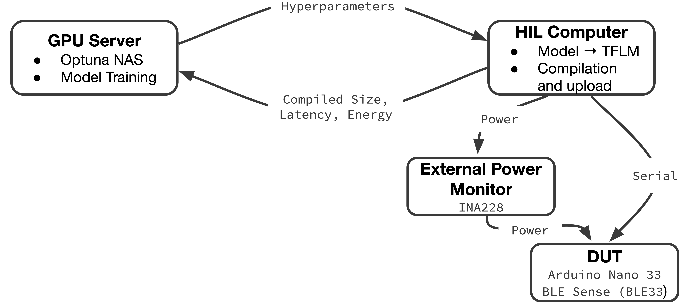
  <figcaption style="font-size: 0.9em; color: #555; margin-top: 4px;">
    <strong>Figure X.</strong> High-level system partition for TinyODOM-EX. The GPU server runs Optuna NAS and model training, while the HIL computer converts candidates to TensorFlow Lite Micro, compiles and uploads firmware to the device under test (Arduino Nano 33 BLE Sense). The DUT is powered through an inline INA228 monitor, enabling external energy measurement; the HIL pipeline returns compiled flash/RAM, on-device latency, and measured energy to the NAS loop.
  </figcaption>
</figure>

TinyODOM-EX refactors the legacy jupyter-notebook-style workflow into a modular pipeline with explicit GPU-side and hardware-side responsibilities. As summarized in Figure X, the NAS client runs on a GPU server and handles neural architecture search and training, while a separate hardware-in-the-loop (HIL) machine is responsible for conversion, compilation, deployment, and on-device measurement. The system can run in a two-machine configuration (GPU server plus local HIL host) or a single-machine configuration when the GPU host has physical access to the DUT. The communication between the two machines (or inter-machine) uses the ZeroMQ (ZMQ) library in a request-reply (REQ-REP) client/server functionality [CITE, ZMQ]. 

#### **3.1.1 Per-trial Workflow**
<figure style="text-align: left">
  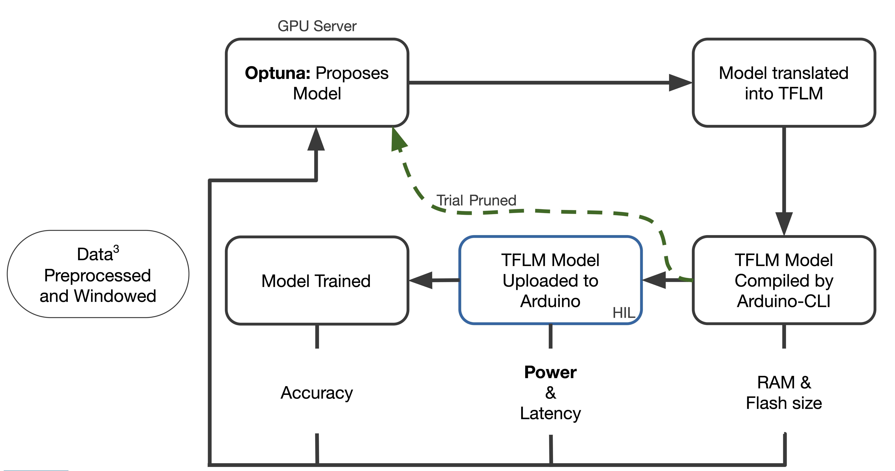
  <figcaption style="font-size: 0.9em; color: #555; margin-top: 4px;">
    <strong>Figure XYZ.</strong> Per-trial workflow for TinyODOM-EX. Each trial trains and evaluates a candidate model on the GPU server, then exports to TFLite Micro, compiles and uploads firmware via Arduino CLI, and measures on-device metrics in the HIL loop. Trials may terminate early when candidates are infeasible or are pruned.
  </figcaption>
</figure>

Figure Y expands the system overview by showing the end-to-end steps executed for a single trial. Each Optuna trial corresponds to one sampled candidate architecture. The NAS client (the GPU server) sends the HIL server (the HIL machine) the hyperparameters, which are then built into a TensorFlow model, converted into a TensorFlow Lite Micro model, and compiled via the Arduino CLI [CITE, Arduino-CLI]. The CLI returns the compiled RAM and flash sizes needed for this model. 

At this point, the arena, the statically allocated tensor arena buffer used by TensorFlow Lite Micro to allocate activation tensors and operator scratch space at runtime [CITE, TFLM], is either stepped up or down in size depending on if the model will fit on the board. If TensorFlow Lite Micro cannot successfully allocate tensors within the arena (even after searching across allowable arena sizes), the trial stops here and is pruned so that the expensive steps of flashing and GPU training are avoided. If the arena search is exhausted, the trial stops there and is pruned so that the expensive step of uploading and model training is avoided. If an ideal arena size can be found, the model is uploaded to the DUT and inference is run with 10 windows. This is a departure from TinyODOM which only ran inference with one window [CITE, TinyODOM code].By averaging the latency per window (and energy per inference when the INA228 measurement path is enabled) across 10 windows, the startup cost is amortized and the true latency and energy per inference can be better determined. The latency per inference, the energy per inference, RAM and flash size is then passed back to the GPU server in the ZMQ response. The GPU server then trains the candidate model and all of the metrics are returned to the NAS and incorporated into the study objective. After receiving these hardware-grounded metrics, the GPU server trains the same candidate architecture and evaluates it on the validation split, then incorporates both validation accuracy and the returned hardware metrics into the study objective.

#### **3.1.2 Configuration**
TinyODOM-EX replaces hard-coded constants in the legacy notebook with a YAML configuration file (`nas_config.yaml`) that captures device settings, dataset parameters, training budgets, etc. This configuration file is shared between the GPU server and the HIL machine. At the end of the study, this configuration is copied into the study output directory so that each run is self-describing and can be reproduced. 

### **3.2 Dataset and Windowing Pipeline**

<figure style="text-align: left">
  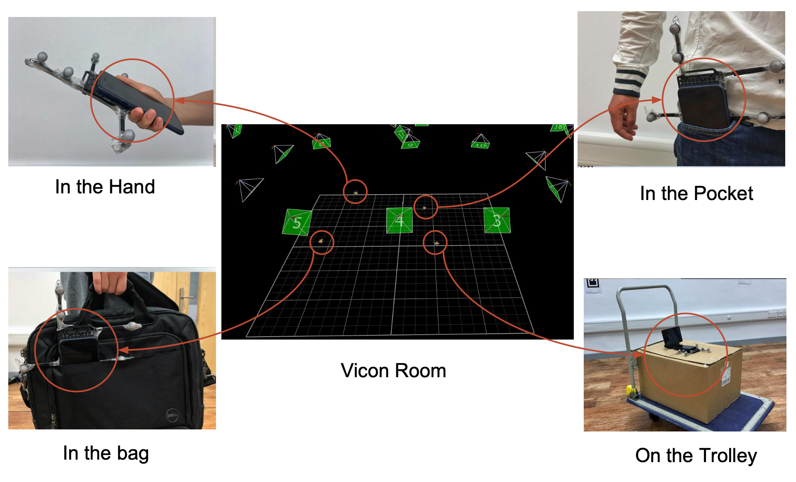
  <figcaption style="font-size: 0.9em; color: #555; margin-top: 4px;">
    <strong>Figure x.</strong> OxIOD collection environment and example device placements (handheld, pocket, handbag, trolley) within the Vicon motion-capture room. This motivates the modality diversity used in TinyODOM-EX and the availability of high-quality ground truth for evaluation [CITE, OxIOD].
  </figcaption>
</figure>

Similar to TinyODOM, this project uses the Oxford Inertial Odometry Dataset (OxIOD) as the base inertial odometry corpus [CTIE, OxIOD][CITE, TinyODOM]. OxIOD is a publicly available smartphone-based IMU dataset collected in a Vicon motion-capture room (approximately 4x5m) to provide high-quality ground truth aligned with IMU measurements [CITE, OxIOD]. In TinyODOM-EX, we use the same six modalities used by TinyODOM: handbag, handheld, pocket, running, slow walking and trolley [CITE, TinyODOM] [CITE, TinyODOM code]. Figure X comes from the OxIOD paper and illustrates four of the modalities they collected.

#### **3.2.1 Data Split**

<figure style="text-align: left">
  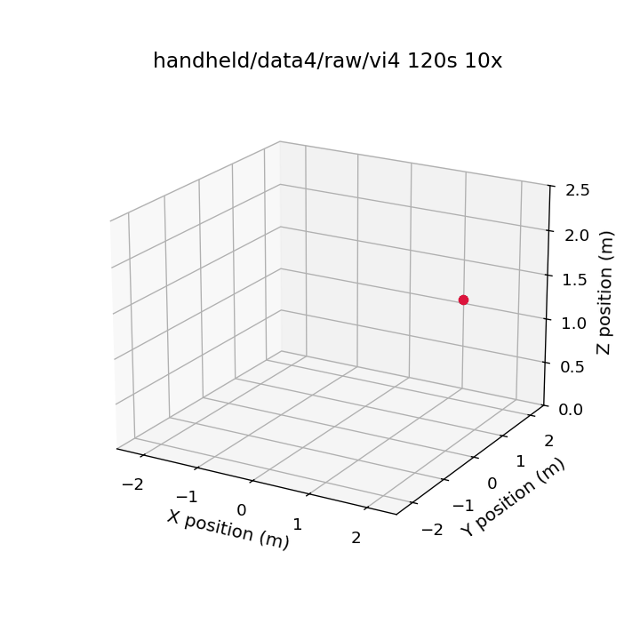
  <figcaption style="font-size: 0.9em; color: #555; margin-top: 4px;">
    <strong>Figure Y. </strong> Example OxIOD handheld sequence (first 120 seconds) visualized using Vicon ground truth. The trajectory illustrates the small-room operating envelope and the continuous nature of each sequence.
  </figcaption>
</figure>

Like TinyODOM, we split OxIOD at the sequence (file) level rather than the window level. This avoids the leakage that would occur if highly overlapping windows from the same underlying trajectory were distributed  across the train, validation and test sets. Each modality folder contains text files (`Train.txt`, `Valid.txt`, `Test.txt`) which list which trajectories belong to each split. TinyODOM-EX includes a script to generate this directory structure and split files after downloading OxIOD. This script is called `prepare_oxiod.py` and is located in the dataset_download_and_splits folder. 

In this work, we used 71 trajectories in total, matching the trajectory count used by the TinyODOM reference implementation [CITE, TinyODOM code]. We partition these into 50 training trajectories, 14 validation trajectories and 7 test trajectories which is approximately a 70/20/10 split. This differs from TinyODOM which used a 85/5/10 split [CITE, TinyODOM]. Our motivation for using a larger validation split in TinyODOM-EX is that we explicitly train against validation loss during the NAS while the TinyODOM reference implementation trains with `model.fit` on the training data only (checkpointing on training loss) and then evaluates on the validation set after training. Whereas TinyODOM-EX passes the validation data into `model.fit`, checkpoints on the validation loss and applies early stopping during the neural architecture search based on the validation loss [CITE, TinyODOM code]. Figure Y illustrates the first 120 seconds of a handheld trajectory in the validation split. 

#### **3.2.2 Data Processing**

The OxIOD data loader in TinyODOM-EX is adapted directly from the TinyODOM reference implementation to keep processing behavior consistent [CITE, TinyODOM code]. Each IMU sequence is converted into a set of overlapping fixed-length windows using a sliding window size and stride length defined in the configuration file. The dataloader constructs three-axis acceleration by combining the provided linear acceleration and gravity estimates, concatenates the three-axis gyroscope and optionally includes the magnetometer channels and a step-indicator. The step indicator, which is also optionally used in TinyODOM, applies a pedometer library to the acceleration stream and produces a binary channel marking detected step locations. Ground truths were also computed over each window based on the Vicon positions [CITE, TinyODOM code]. For all experiments reported here, both the magnetometer and step-indicator channels were used. 

Similar to TinyODOM, the window size for these studies was 200 samples [CITE, TinyODOM]. This corresponds to a 2 second window. Unlike TinyODOM, which used a 10 sample stride, we used a 20 sample stride [CITE, TInyODOM code]. This produces a new window every 200 ms (a 5 Hz update rate), increasing the allowable per-inference latency to maintain a real-time streaming target. This was specifically changed to give more time for inference for each window to allow for better accuracy while still remaining real-time. This is especially evident when looking at the accuracy vs latency Pareto front plot in [Section 4.4.1](#441-pareto-front-and-convergence).

### **3.3 NAS Objective, Search Space, and Training Procedure**

This report uses the same terminology for experimentation as Optuna. A "study" refers to a full Optuna run with an objective, and a trial refers to one architecture and its resulting training, validation and hardware measurements [CITE, Optuna trial]. TinyODOM-EX supports both single-objective (optimization with a scoring function) and multi-objective studies, with the configuration file controlling which type is run and whether energy is included in the optimization. 

TinyODOM-EX's NAS searches over hyperparameters for a temporal convolution network that maps the windowed inertial inputs to velocity (x and y) outputs. The search space is derived from the TinyODOM TCN design, while extending evaluation to incorporate hardware-grounded constraints *and* measured energy [CITE, TinyODOM]. Across the full set of sampled hyperparemeters (detailed in Table X) for TinyODOM-EX, the search space spans approximately 8 million candidate combinations. 

<figure style="text-align: left">
  <figcaption style="font-size: 0.9em; color: #555; margin-bottom: 4px;">
    <strong>Table X.</strong> Hyperparameter search space summary for the TinyODOM-EX TCN family. The table lists the tunable parameters available to Optuna. These parameters are the same as in TinyODOm [CITE, TinyODOM].
  </figcaption>
</figure>

| Hyperparameter       | Range                          | What it does                                             |
| -------------------- | ------------------------------ | -------------------------------------------------------- |
| nb_filters           | 2 to 63                        | Controls model width / capacity                          |
| kernel_size          | 2 to 15                        | Temporal receptive field per layer                       |
| dropout_rate         | 0 to 1 (discretized every 0.2) | Regularization                                           |
| use_skip_connections | T/F                            | Residual or plain blocks                                 |
| norm_flag            | T/F                            | Normalization                                            |
| dilations            | Categorical (465 options)      | Pattern of dilation across layers (e.g., [1, 4, 16, 32]) |

The hyperparemeters in Table X jointly influence not only the accuracy of the model (RMSE), but also the feasibility of deployment to the target due to the flash/RAM constraints.

#### **3.3.1 Objective Functions**
For single objective studies, TinyODOM-EX uses a score function that combines the validation accuracy, memory usage, latency and energy per inference (see Eq. 1). Accuracy is computed from the validation RMSE on the predicted velocity components. Memory terms are computed from the reported flash and RAM usage (returned by the HIL pipeline). Even though latency was included as a metric in TinyODOM, we chose to change how the penalty was calculated. In TinyODOM, the latency penalty was a scalar multiplied by the latency in milliseconds [CITE, TinyODOM code]. We found that this was challenging to tune and decided to instead compare the latency to the real-time budget and only apply the latency penalty when the measured latency exceeded the budget. The budget is derived based on the sampling rate and stride length. We also decided to clamp that penalty to a maximum of 2 in order to keep the scores reasonable (see Eq. 2). When energy is enabled (based on the config), the score penalizes candidates whose measured energy exceed a target. In our experiments, we chose to use 10 mJ as our target. Note, that unlike the latency penalty, the energy penalty could actually be a bonus if the power was less than the target.

<figure style="text-align: left">
  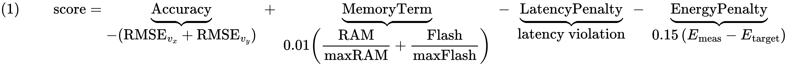
  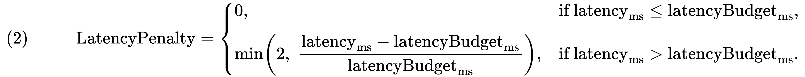
</figure>

#### **3.3.2 Training and Pruning***
To get the accuracy metric, each trial trains for a minimum of 40 epochs and a maximum of 50 epochs (based on an early stopping system). The early stopping is based on the validation loss. Additionally, to keep studies accurate, Optuna can prune trials early. For our studies, this only happened when the arena was exhausted, however, if there was a different error code thrown, it would also have pruned the trial. This is different from TinyODOM's Mango optimizer. TinyODOM set models that wouldn't work to -5 (a number more negative than their typical scores) [CITE, TinyODOM]. For multi-objective studies, Optuna does not support pruning, so the objectives under test were given large constants and the trials were removed upon completion. 

### **3.4 Hardware in the Loop Measurement and Implementation**
<figure style="text-align: left">
  
  <figcaption style="font-size: 0.9em; color: #555; margin-top: 4px;">
    <strong>Figure X.</strong>  Physical HIL setup for TinyODOM-EX. The Arduino Nano 33 BLE Sense is powered through an inline Adafruit INA228 breakout, enabling external energy measurement during inference. The DUT also configures and reads the INA228 over I2C. Telemetry is returned to the host over USB serial.
  </figcaption>
</figure>

<figure style="text-align: left">
  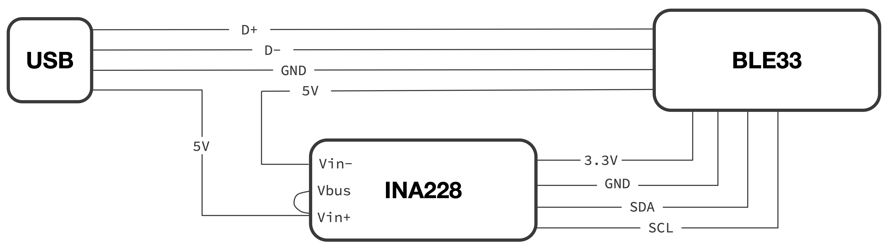
  <figcaption style="font-size: 0.9em; color: #555; margin-top: 4px;">
    <strong>Figure X.</strong>  Wiring diagram for the TinyODOM-EX HIL setup. USB D+/D− and GND connect directly to the BLE33 for serial telemetry, while the USB 5 V supply is routed through the INA228 shunt (Vin+ → Vin−) to measure current and energy. The BLE33 powers the INA228 logic from its 3.3 V rail and configures/reads the INA228 over I2C (SDA/SCL).
  </figcaption>
</figure>

As shown in Figures X and Y, TinyODOM-EX instruments energy by inserting an Adafruit INA228 power monitor inline with the DUT supply rail, while leaving the USB data lines (D+/D−) untouched for serial telemetry. The USB 5V supply is routed into the INA228 Vin+ terminal, and the DUT is powered from the INA228 Vin- terminal so that the on-board 15 mΩ shunt is in series with the DUT [CITE, Adafruit]. This configuration allows the system to report energy per inference based on the accumulated, directly measured energy instead of relying solely on proxy metrics such as FLOPs. 

A deliberate simplification in TinyODOM-EX is that the DUT configures and reads the INA228 over I2C instead of delegating that to a second "harness" MCU. This reduces coordination complexity. However, this means that the reported energy overhead includes the INA228. According to the INA228's datasheet, the supply current is approximately 0.64 mA, which corresponds to about 2.1 mW power draw at its 3.3 V logic rail [CITE, TI INA228].

TinyODOM-EX uses a TensorFlow Lite Micro inference harness to benchmark the candidate models on the Arduino Nano 33 BLE Sense. The harness initializes the TFLM interpreter, allocates the fixed arena, loads the candidate models and runs repeated inferences on a set of input windows. To reduce the influence of setup and measurement jitter, inference is run 10 times and the energy and latency is averaged per inference. 

Finally, to support both energy-aware and latency-only studies without manual code edits, TinyODOM-EX maintains two Arduino sketches:
1. `tinyodom_tcn_energy.ino`, which enables the INA228-based energy measurement and reports energy, power, current, voltage and latency.
2. `tinyodom_tcn_no_energy.ino`, which omits the INA228/I2C setup and reports just latency.

This split is because the INA228/I2C libraries take up memory headroom on the board. The HIL server selects the appropriate sketch at runtime based on the YAML configuration and copies it into the build directory.

After execution, the sketch prints the telemetry over serial. The HIL computer parses this output using regex and returns the parsed metrics to the NAS client for incorporation into the study (see [Section 3.3](#33-nas-objective-search-space-and-training-procedure) for details).

### **3.5 Key Design Decisions and Tradeoffs**
As TinyODOM-EX evolved from the original TinyODOM reference workflow into an end-to-end hardware-aware NAS system, the primary challenges shifted from model design to system integration and experimental reliability. In particular, maintaining reproducible studies and debuggable code while repeatedly converting, compiling, flashing, and measuring candidate models required several architectural and tooling choices. The remainder of this section documents the key decisions and the tradeoffs they introduced.

#### **3.5.1 Optuna-based NAS instead of Mango**
TinyODOM used Mango as its tuner, but TinyODOM-EX is built around Optuna instead because it better matched the project's needs once the hardware-in-the-loop constraints and need for multi-objective studies were introduced. Mango is explicitly positioned as a Python library for parallel hyperparameter tuning based on Bayesian optimization, with emphasis on abstraction, flexibility and fault-tolerant execution. Those are strong properties for scaling optimization, and they generally align with the needs of a NAS-style workflow [CITE, Mango].

However, TinyODOM-EX required two capabilities that were central: a path to multi-objective search in order to create Pareto Frontiers and practical mechanisms to terminate infeasible trials to reduce experiment time.
Optuna provided both single-objective Bayesian optimization via TPE sampling, and a multi-objective mode using an NSGA-II sampler, both of which are used by TinyODOM-EX [CITE, Optuna TPE] [CITE, Optuna NSGAii]. Additionally, Optuna has built out a library of visualization and storage/logging functions. In fact, Figure ZZZ in [Section 4.5.2](#452-energy-oriented-hyperparameter-structure) was created using Optuna's visualization utilities.

#### **3.5.2 Separate Energy-instrumented and Latency-Only Firmware**
TinyODOM-EX maintains two Arduino measurement sketches as described in [Section 3.4](#34-hardware-in-the-loop-measurement-and-implementation) above. The motivation is a direct resource tradeoff on the microcontroller. The INA228's measurement support (I2C libraries and device drivers) increases the flash and RAM usage, which can reduce the maximum feasible model size. To avoid artifically constraining the search space in studies when energy is not being optimized, the latency-only sketch omits the INA228 setup and only reports timing. In the future, if a second harness board runs the DUT, this will no longer be an issue.

#### **3.5.3 Dropping the Arduino Nano RP2040 Target From Final Studies**
TinyODOM-EX initially targeted using multiple boards, but the final set of experiments focus solely on the Arduino Nano 33 BLE Sense because the RP2040 path did not meet the reliability requirement for an unattended NAS study.  Under repeated compile-flash-measure cycles, the RP2040 required manual intervention (needing the program button pushed to re-enter the bootloader state), which was infeasible for long running studies. In fact, in our setup, the board was only ever able to be programmed once before needing to be reset manually. 

There was a practical tradeoff here: excluding the RP2040 meant that there was no comparison of hardware in the final results. However, the benefit is that by avoiding needing to run single-objective scoring studies with the RP2040, there was time to run additional multi-objective studies which yielded great results (as described in the next section).

A plausible mitigation for a future RP2040-based NAS run is to automate the recovery. We found community documentation from others in the community that also struggled with this on the RP2040 and they recommend using a secondary RP2040 (or other MCU) as a debug probe and controlling the reset behavior via the RUN pin to recover from hard faults without human interaction. Using a Pico as a probe is documented and widely used (often referred to as a "Picoprobe"), and the RUN pin can be used to reset the RP2040 by pulling it low [CITE, Picoprobe] [CITE, RUN pin]

#### **3.5.4 Modular Refactor and YAML Configuration**
Finally, TinyODOM-EX's refactor from a monolithic, jupyter-notebook workflow into a NAS client, HIL server, utility functions across multiple files and a centralized YAML configuration was a deliberate design choice to improve reproducibility and operational reliability. The YAML file allows the study to be self-describing, and studies can easily be analyzed without worrying that hardcoded parameters had changed between runs. Additionally, by moving into individual python files, it allowed for unit tests to be written and bugs to be caught using those prior to expensive mistakes mid-study. The downside of this approach was higher upfront cost and a more complex code layout than a single script. This new modular system means that in the future, a new compile and upload chain could be used to bring a new board from a different manufacturer without needing to change the entirety of the code.

---

# **4. Evaluation & Results**

- Summarize the four experimental studies and common metrics
- Present baseline reproduction of TinyODOM on BLE33 as a reference point
- Evaluate the effect of adding energy logging in single-objective NAS
- Analyze multi-objective fronts for accuracy–latency and accuracy–energy
- Quantify NAS convergence and trial budget sufficiency

### **4.1 Experimental Studies and Metrics**

- Overview of the four studies
  - Study 1: Single-objective NAS, BLE33, score without energy logging
  - Study 2: Single-objective NAS, BLE33, score with energy logging
  - Study 3: Multi-objective NAS, accuracy vs latency
  - Study 4: Multi-objective NAS, accuracy vs energy per inference
- Common evaluation metrics
  - OxIOD splits and velocity / trajectory error metrics (RMSE, trajectory drift)
  - Latency per inference on BLE33, flash usage, RAM usage
  - Energy per inference from HIL measurement pipeline
- Pointer back to Section 3 for experimental setup
  - HIL infrastructure, number of trials, key hyperparameters

### **4.2 Reproducing TinyODOM on BLE33 (Study 1)**

#### **4.2.1 Baseline Model Quality**

- Compare TinyODOM-like model performance on BLE33 to original TinyODOM results [1]
- Figures
  - Trajectory overlays: model vs ground truth and bias-corrected IMU integration baseline
  - Velocity time-series and/or error-over-time plots for representative sequences
  - Predicted vs true velocity histograms to assess calibration
- Table of baseline metrics
  - RMSE per axis, trajectory error, summary across key OxIOD sequences
- Interpretation
  - Where the learned model improves over the classical baseline
  - Failure modes and typical error patterns

#### **4.2.2 Baseline Latency and Model Size Profile**

- Report typical latency and model size for the best TinyODOM-like model(s)
  - Table with: latency per inference, flash usage, RAM usage for 1–2 representative models
- Brief note on constraint handling
  - By design, the NAS loop prunes or discards trials that exceed BLE33 flash/RAM limits
  - As a result, all models discussed in this section satisfy deployment constraints by construction
- Interpretation
  - Position baseline TinyODOM-like models on the latency / size spectrum
  - Use this as a reference point for later energy-aware and multi-objective models

### **4.3 Single-Objective Energy-Aware NAS on BLE33 (Study 2)**

The single-objective NAS runs use a scalar score that combines accuracy, memory, latency, and (optionally) energy per inference. For each trial, the validation velocity RMSE in x and y is converted into an accuracy term, a small resource term encodes relative RAM and flash usage, and latency and energy penalties are applied when the BLE33 hardware measurements exceed a 200 ms latency budget and an implicit 10 mJ energy target. See [Section 3.3](#33-nas-objective-search-space-and-training-procedure) for details on the score function. Note that higher scores correspond to lower validation error and fewer constraint violations. Scores in all but a handful of trials were negative.

#### **4.3.1 Effect of Energy Logging on NAS Outcome**

<figure style="text-align: left">
  <figcaption style="font-size: 0.9em; color: #555; margin-bottom: 4px;">
    <strong>Table X.</strong> Heuristic contributions of each term to the absolute scalar score for the single-objective NAS runs on BLE33 (75 trials each). The score combines accuracy, resource usage, latency, and optional energy penalties.
  </figcaption>
</figure>

| Term            | No-energy score (%) | Energy-aware score (%) |
|-----------------|---------------------|------------------------|
| `model_acc`     | 77.4                | 55.1                   |
| `latency_term`  | 21.9                | 9.9                    |
| `energy_term`   | --                  | 34.7                   |
| `resource_term` | 0.7                 | 0.4                    |

Table X compares how the scalar score is distributed across components in the no-energy and energy-aware single-objective runs on BLE33. In the no-energy setting, the score is dominated by the accuracy term: the model accuracy term accounts for about 77% of the absolute score, the latency penalty contributes roughly 22%, and the resource term is negligible. When energy measurements are enabled, the energy penalty becomes a first-class objective and takes about 35% of the score magnitude. The share of model accuracy term drops to roughly 55% and the latency contribution falls below 10%, while the resource term remains insignificant.

The mean model accuracy value becomes slightly more negative in the energy-aware run, indicating a modest loss in validation accuracy as the optimizer trades off some performance for lower energy per inference. The mean latency penalty remains almost unchanged between the two runs, which is consistent with the BLE33 latency budget being satisfied by most trials in both cases. Overall, these statistics confirm that enabling the energy term rebalances the single-objective score toward energy per inference without turning it into a pure energy minimization problem: accuracy still carries the largest weight, but energy now plays a comparable role to latency in shaping the search.

#### **4.3.2 Empirical Relationship Between Energy and Latency**
A central question in TinyODOM-EX is whether energy must be modeled and optimized explicitly, or whether latency alone is a sufficient proxy on the BLE33. Adding energy awareness increases system complexity and adds an additional source of experimental variance. This section quantifies how tightly energy per inference and latency per inference are coupled in practice. The key result is that, for this target and workload,  

<figure style="text-align: left">
  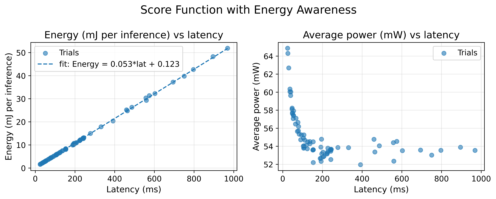
  <figcaption style="font-size: 0.9em; color: #555; margin-top: 4px;">
    <strong>Figure X.</strong> Empirical mapping of energy and latency on the BLE33 across measured trials. Left: energy per inference versus latency with a least-squares linear fit. Right: average power versus latency, computed as energy divided by latency.
  </figcaption>
</figure>

Figure X (left) shows a near-linear relationship between energy per inference and latency across the measured trials. The fitted lined, `Energy (mJ) ≈ 0.053 * Latency (ms) + 0.123`, indicates that most of the variation in energy is explained by the latency alone. This slope, 0.053 mJ/ms, corresponds to an average inference power of approximately 53 mW (since mJ/ms is equivalent to Watts). This implies that candidates primarily change the duration of the computation, while the average power during inference remains relatively stable. The non-zero intercept, 0.123 mJ, suggests a small fixed energy overhead per inference that does not scale with latency. This could be anything from constant work outside the model's main compute or framework overhead.

Figure X (right) explains the shape of the average-power plot. If energy is approximately linear with time, `E = a*t + b`, then the average power is `P_avg = E/t ≈ a + b/t`. This would produce a hyperbolic asymptote at a (53 mW) and the values would plateau at around that value for higher latencies. On the other hand, very short latency trials appear to have a higher power because the fixed-energy term b contributes more strongly when divided by a small t.

Taken together, these observations indicate that, for the BLE33 and the TinyODOM-EX inference workload, energy and latency are tightly coupled across the explored architecture space. As a result, latency serves as a strong proxy for energy over the dominant operating range of interest, and explicitly optimizing energy is unlikely to change model selection except in the very low-latency regime where fixed overheads and modest power variation become more visible.

### **4.4 Multi-Objective NAS: Accuracy vs Latency (Study 3)**
In Study 3, we reformulate the search as a true multi-objective optimization over model accuracy and on-device inference latency. This makes the real deployment tradeoff explicit: lower RMSE typically requires more compute, but real-time operation imposes a hard upper limit on latency set by the streaming update schedule. Rather than collapsing these competing goals into a single weighted score like in Study 1, we use Optuna's multi-objective search to recover a Pareto Frontier, then analyze the results to identify if the real-time constraint is feasible and which hyperparameters most strongly control the accuracy-latency tradeoff.

#### **4.4.1 Pareto Front**

<figure style="text-align: left">
  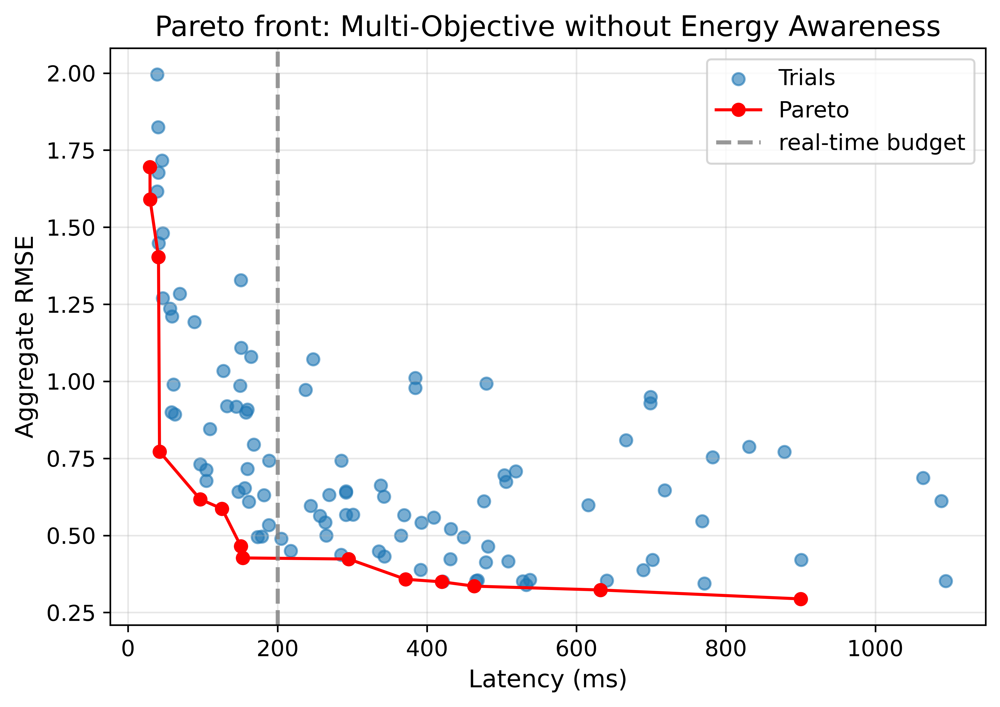
  <figcaption style="font-size: 0.9em; color: #555; margin-top: 4px;">
    <strong>Figure X.</strong> Accuracy–latency Pareto front for the multi-objective NAS run on the BLE33 without an explicit energy term. Blue points are individual trials, plotted by latency and aggregate  RMSE. The red curve marks the Pareto-optimal set. The vertical dashed line at 200ms indicates the real-time latency budget implied by the 100Hz sampling rate and a stride of 20 samples between windows.
  </figcaption>
</figure>

Figure X shows the tradeoff between aggregate RMSE over vx and vy and on-device latency in the accuracy–latency multi objective run. The cloud of blue points indicates that the search explored a wide range of models, from very fast but inaccurate configurations to slower and more accurate ones. The red Pareto curve traces the non-dominated set (i.e. the best possible trade-off trials). Moving along this curve from left to right trades higher latency for lower error. The front drops steeply as latency increases from tens of milliseconds to roughly the 150–200 ms range, then flattens as latency approaches several hundred milliseconds.

The vertical 200 ms line marks the real-time budget implied by the streaming configuration (see [Section 3.3](#33-nas-objective-search-space-and-training-procedure) for details). Several Pareto points lie to the left of this line with aggregate RMSE close to the global minimum, which shows that satisfying the real-time constraint is not restrictive for this dataset and search space. Slower models beyond the budget provide only modest additional accuracy gains compared to the best models that already meet the budget. In practice, this creates a clear knee in the accuracy–latency curve just before the real-time boundary where small movements past this region increase latency noticeably while improving error only slightly. Such knees on a Pareto front are often used as preferred compromise points in multi-objective decision making [CITE, Branke]. Through this Pareto front plot, we can see that if we had enforce a 100 ms latency budget (corresponding to a 10 Hz update rate), the accuracy would have been much worse (~2x difference). See  [Section 3.2](#32-dataset-and-windowing-pipeline) for details on the change from 100 ms update rate to 200 ms update rate.

#### **4.4.2 Hyperparameter Sensitivity for Latency-Oriented Search**

<figure style="text-align: left">
  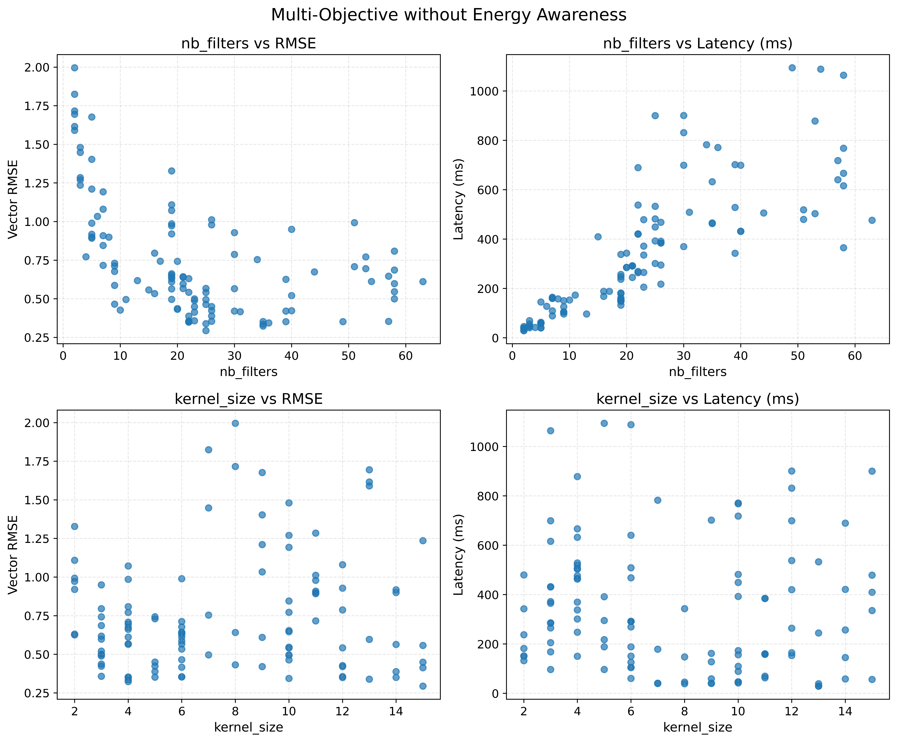
  <figcaption style="font-size: 0.9em; color: #555; margin-top: 4px;">
    <strong>Figure x.</strong> Hyperparameter sensitivity in the accuracy–latency multi-objective run on the BLE33. Top: nb_filters versus vector RMSE (left, with a logarithmic best-fit curve) and latency per inference (right, with a linear best-fit line). Bottom: kernel_size versus vector RMSE (left) and latency (right).
  </figcaption>
</figure>

Figure X shows how `nb_filters` and `kernel_size` correlate with accuracy and latency in the accuracy versus latency multi objective run. The top row indicates that `nb_filters` is a strong driver of both accuracy and latency. The `nb_filters`–RMSE panel includes a simple logarithmic best-fit curve, which highlights a diminishing returns pattern, i.e. error falls quickly as channel count increases from very small models, then tapers off once `nb_filters` reaches the mid range. The `nb_filters`–latency panel includes a linear best-fit line, which emphasizes the approximately linear growth of latency with channel count despite some scatter. Together, these two trends show that the most accurate models are also among the slowest, and that increasing `nb_filters` beyond the mid range mostly increases cost while providing only modest additional accuracy.

The bottom row shows that `kernel_size` is a much weaker knob. Good and bad models are spread across the kernel sizes explored, and there is no clear monotonic trend between `kernel_size` and either RMSE or latency. Some kernel sizes contain both low error and high error models, and latency varies widely within each kernel size. This is consistent with `kernel_size` behaving as a secondary design choice once the receptive field is sufficient, while `nb_filters` primarily controls both model quality and computational cost.

A similar Optuna hyperparameter-importance analysis for the accuracy–latency run (not shown) yields the same qualitative ranking as the energy-aware study (see Fig. Z in [Section 4.5.2](#452-energy-oriented-hyperparameter-structure) for details). In both cases,  `nb_filters` dominates, `kernel_size` has moderate influence, and the remaining knobs contribute very little. This supports treating `nb_filters` as the primary design knob in the rest of our analysis.

### **4.5 Multi-Objective NAS: Accuracy vs Energy (Study 4)**
Study 4 extends the multi-objective formulation to explicitly include energy per inference, measured with the inline INA228 as described in (Section 3.4)[#34-hardware-in-the-loop-measurement-and-implementation]. Latency is a useful proxy for cost, but energy is the more direct constraint for battery-powered and energy-harvesting deployments. By optimizing accuracy and energy jointly, we obtain the accuracy-energy Pareto frontier that highights the "efficient" region of the design space and enables the selection of models that meet a target energy budget while retaining most of the achievable accuracy. Similar to Study 3, we then identify the most important hyperparameters for the design space.

#### **4.5.1 Pareto Front**

<figure style="text-align: left">
  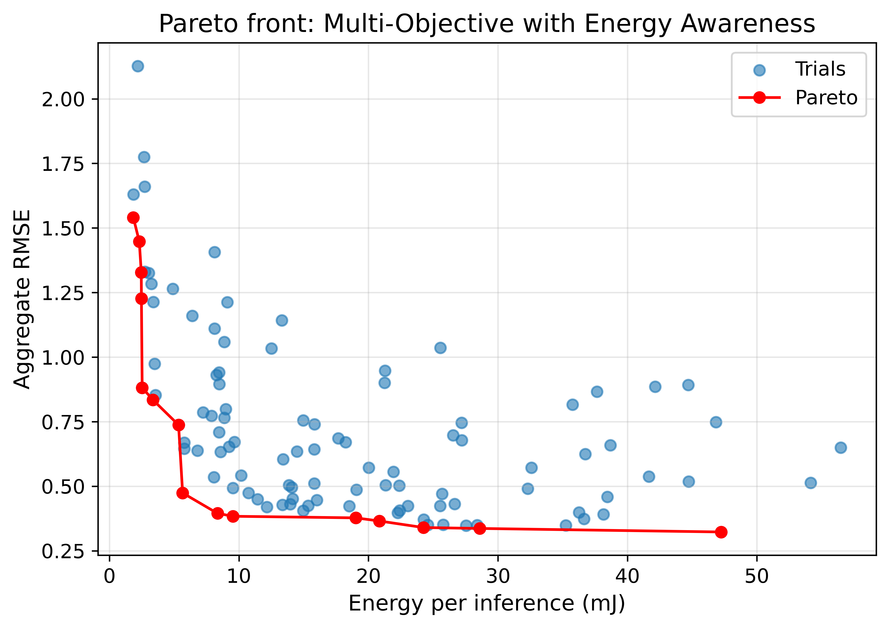
  <figcaption style="font-size: 0.9em; color: #555; margin-top: 4px;">
    <strong>Figure X.</strong> Accuracy–energy Pareto front for the multi-objective NAS run with an explicit energy objective. Blue points show individual trials plotted by energy per inference (mJ) and aggregate RMSE. The red curve denotes the Pareto-optimal set. The target energy used in the scoring function, 10mJ, corresponds to running within the 200ms latency budget at a nominal power of 50mW.
  </figcaption>
</figure>

Figure X shows the tradeoff in the accuracy–energy space for the energy-aware multi objective run. As in the latency plot in [Section 4.4.1](#441-pareto-front-and-convergence), the blue points indicate the search covers a broad spectrum of designs, while the red curve again highlights the nondominated trials. Again, similar to the accuracy-latency plot, the Pareto front has a steep initial segment moving from the lowest energy models to more expensive trials initially yields large reductions in aggregate RMSE. Around a mid range energy level, near the 10mJ target implied by the 200ms latency budget and a 50mW nominal power draw, the curve indicates diminishing returns.

This shape suggests a natural operating regime for deployment. Very low energy models exist, but they incur substantial error. Increasing energy per inference up to the mid range buys most of the available accuracy improvement, while pushing to very high energy models produces only small additional gains. Together with the accuracy–latency Pareto in Figure X in [Section 4.4.1](#441-pareto-front-and-convergence), these curve show that the search space contains models that are both reasonably accurate, energy efficient and operate in a real-time setting.

#### **4.5.2 Energy-Oriented Hyperparameter Structure**

<figure style="text-align: left">
  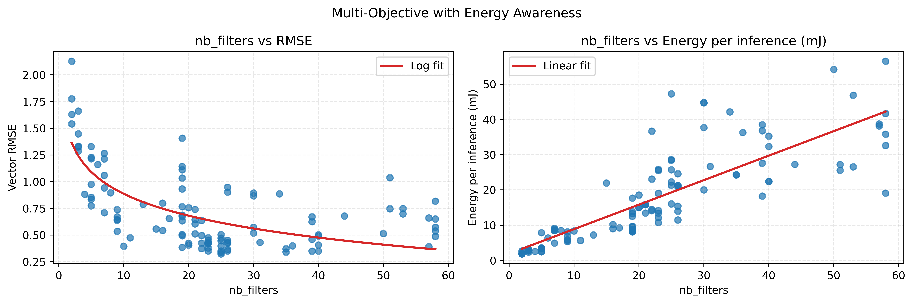
  <figcaption style="font-size: 0.9em; color: #555; margin-top: 4px;">
    <strong>Figure x.</strong> Effect of nb_filters on accuracy and energy per inference in the accuracy–energy multi objective NAS run on the BLE33. Left: nb_filters versus vector RMSE with a logarithmic best-fit curve. Right: nb_filters versus energy per inference with a linear best-fit line..
  </figcaption>
</figure>

Figure X shows that for the energy aware multi objective study, `nb_filters` are still the dominant hyperparameter. The `nb_filters`–RMSE panel includes a logarithmic best-fit curve and shows that increasing channel count from very small models to the mid range generally reduces error, after which gains tend to taper off. The `nb_filters`–energy panel includes a linear best-fit line and illustrates that energy per inference increases approximately linearly with `nb_filters`, with moderate spread due to other architectural choices. Together, these plots indicate that channel count controls a smooth accuracy–energy tradeoff. Larger `nb_filters` provide some accuracy improvements but at a predictable energy cost.

`kernel_size` versus RMSE and energy was also examined (plots not shown to avoid redundancy) and, as in the accuracy–latency run, did not exhibit strong structure. This reinforces that `kernel_size` behaves as a secondary knob in the current search space, while `nb_filters` primarily determines both model quality and resource usage.

<figure style="text-align: left">
  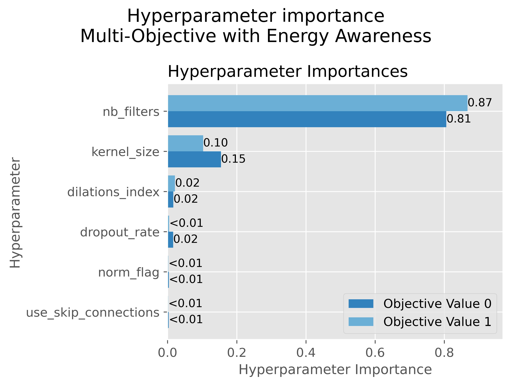
  <figcaption style="font-size: 0.9em; color: #555; margin-top: 4px;">
    <strong>Figure ZZZ.</strong> Optuna-created hyperparameter importance for the accuracy–energy multi-objective NAS run on the BLE33. Bars show the relative contribution of each hyperparameter to variation in the two objectives (aggregate RMSE and energy per inference). nb_filters dominates both objectives, while kernel_size has moderate influence and the remaining knobs contribute little.
  </figcaption>
</figure>

Figure Z summarizes this pattern using Optuna’s hyperparameter importance metrics for the energy-aware run. For both objectives, `nb_filters` accounts for the vast majority of explained variation (importance ≈ 0.8–0.9), `kernel_size` has modest but non-negligible influence, and the remaining hyperparameters (dilation pattern, dropout, normalization flag, and skip connections) contribute very little. 

### **4.6 Cross-Study Comparison and NAS Trial Budget**

#### **4.6.1 Summary of Best Models Across Studies**

- Table summarizing selected models from each study
  - For each: RMSE, latency, energy, flash, RAM
- Comparison
  - Baseline TinyODOM-like model vs single-objective energy-aware vs multi-objective models
  - Tradeoff between simplicity of objective and quality of resulting models

#### **4.6.2 NAS Trial Budget and Practical Convergence**

- Use all studies to comment on how many trials are “enough”
- Figures
  - Optuna optimization history curves across studies
  - Hypervolume progression curves for Study 3 and Study 4 on a shared axis
- Interpretation
  - Points where additional trials give minimal improvement
  - Practical guidance: recommended trial counts for future runs on similar hardware
  - Discussion of remaining uncertainty and where more budget might still help

### **4.x Multi-Objective NAS**
- Pareto Frontiers for both latency and EA studies

### **4.x NAS Trial Budget**
- **Goal: choose NAS trial budgets from convergence, not arbitrary counts**
  - Question: how many NAS trials are actually needed for this search space and objectives?
  - Approach: look at convergence of (1) best objective value over trials (single-objective) and (2) hypervolume over trials (multi-objective).

- **Single-objective NAS, score without energy awareness**
  - Optimization history shows rapid improvement in the first ~10–20 trials.
  - Best objective value is already reached by roughly trial 20–25.
  - Relative improvement of best value from 25→50 and 50→75 trials is effectively 0 percent.
  - Interpretation: the search has converged by ~25 trials. The remaining trials only resample around an already discovered optimum.

- **Single-objective NAS, score with energy awareness**
  - Similar behavior: best value improves early and then stays flat.
  - Again, no measurable improvement in best value after about ~25 trials.
  - Conclusion: for this scoring function and search space, ~30–40 trials is a safe upper bound.

- **Effect of seeding with a default configuration**
  - Later single-objective runs start with a manually seeded “default” model (e.g., TinyODOM-like baseline).
  - In those runs the seeded trial is already as good as or better than everything the optimizer finds later.
  - This makes the best-value curve flat, and the plots show that NAS never beats the baseline even with many extra trials.
  - Interpretation: the default model is already near-optimal under the chosen score, and additional trials serve mainly to confirm that.

- **Multi-objective NAS with energy awareness (e.g., energy vs accuracy)**
  - Hypervolume increases sharply over the first ~10–15 trials.
  - By ~20–30 trials, hypervolume is within about 1 percent of its final value.
  - From ~30 to 110 trials, only tiny hypervolume gains are observed.
  - Interpretation: the Pareto front is essentially discovered by ~20–30 trials; further trials slightly refine but do not change the frontier.

- **Multi-objective NAS without energy awareness (e.g., energy vs latency or latency vs accuracy)**
  - Same qualitative pattern: rapid hypervolume growth at the beginning, then an early plateau.
  - Hypervolume after ~15–20 trials is very close to the final value at 100+ trials.
  - Conclusion: 40–60 trials would have been more than sufficient for this multi-objective run.

- **Overall conclusions about trial budgets**
  - For **single-objective** studies in this project, convergence occurs by ~25 trials. A budget of **30–40 trials** is a conservative choice.
  - For **multi-objective** studies, the Pareto hypervolume converges by ~20–30 trials. A budget of **40–60 trials** is a conservative choice.
  - The larger budgets used in the final experiments (75 and 135 trials) are therefore more than sufficient and mostly spend time in the diminishing-returns regime.

- **Potential stopping criteria for future runs**
  - Single-objective: stop if the best score has not improved for the last 15–20 trials.
  - Multi-objective: stop if hypervolume has improved by less than ~1 percent over the last 20 trials.
  - These criteria formalize the convergence behavior observed in the plots.

---
# **5. Discussion & Conclusions**

### **5.1 Summary of Key Findings**

- Brief recap of TinyODOM-EX contributions
  - Reproduction of TinyODOM-style accuracy on BLE33 within a fully automated HIL NAS loop.
  - Successful incorporation of energy logging into both single-objective and multi-objective NAS.
  - Observation of clear accuracy–latency–energy tradeoffs and identification of nb_filters as the dominant hyperparameter.
- High-level statement of what the results collectively show about energy-aware NAS on microcontrollers.

#### **5.1.1 Latency and Energy are Tightly Coupled**
One reason this coupling is so strong on the BLE33 is that inference executes on a sequential general-purpose MCU core (Nordic nRF52840, ARM Cortex-M4F) with limited parallel compute resources [CITE, NEEDED]. For this target, most architectural changes effectively scale the number of executed operations, which changes inference time more than it changes average power at a fixed operating point. As a result, energy tends to scale approximately with latency (energy ≈ power × time) over the explored search space.

In contrast, on ML accelerators with substantial spatial parallelism, latency can drop due to higher parallel utilization without a proportional drop in energy, because the platform may trade lower time for higher instantaneous power or different data-movement behavior. In such settings, explicit energy measurement is more likely to be necessary for model selection [CITE, NEEDED].

### **5.2 Lessons from Energy-Aware NAS and HIL Infrastructure**

- Objectives and optimization behavior
  - Single-objective composite scoring is simple to use but hides the shape of the tradeoff surface.
  - Multi-objective NAS (accuracy–latency and accuracy–energy) exposes Pareto fronts and hypervolume progression, enabling a more explicit view of tradeoffs.
  - Direct optimization for energy per inference can shift the Pareto front relative to optimization for latency alone.

- Search space behavior
  - nb_filters acts as the main capacity and cost knob:
    - Very small models have high RMSE.
    - Mid-range nb_filters provide a good accuracy–cost compromise.
    - Larger nb_filters show diminishing accuracy gains while increasing latency and energy.
  - kernel_size has comparatively weak structure within the explored range and behaves as a secondary design choice once the receptive field is sufficient.
  - PCA projections of hyperparameters do not exhibit strong clustering, suggesting that useful structure resides in higher-dimensional combinations captured better by per-parameter plots and importance scores.

- Measurement and latency–energy relationship
  - Latency and energy per inference are strongly correlated on BLE33 but not in a perfectly one-to-one fashion; outliers motivate direct energy measurement.
  - HIL stability experiments show that repeated runs of the same model have low variance in both latency and energy, supporting the reliability of measurements.

- HIL infrastructure and trial budget
  - GPU-side NAS client and HIL server split works effectively with Optuna as the search engine.
  - Enforcing flash/RAM feasibility inside the HIL loop ensures that all reported models are deployable on BLE33 by construction.
  - Optimization histories and hypervolume curves indicate approximate saturation points, providing empirical guidance on how many trials are needed before returns diminish.

### **5.3 Limitations and Threats to Validity**

- Hardware scope
  - Final quantitative results are obtained on a single device under test (BLE33).
  - RP2040 exploration is limited by board instability; conclusions about energy/latency structure are specific to BLE33.

- Dataset scope
  - All evaluations use the OxIOD dataset with a particular train/validation/test split.
  - Cross-dataset generalization and performance in other environments are not measured.

- Search space and training budget
  - NAS is restricted to a TCN-based search space with specific hyperparameters; other architectures (for example, RNNs, transformers, pruned/quantized variants) are not explored.
  - Each trial uses a fixed training budget; the impact of more aggressive training or early stopping strategies is not fully characterized.

- Measurement assumptions
  - Energy measurements are taken at the board level under a specific harness, supply path, and workload.
  - Different clocking schemes, peripheral usage, or deployment scenarios may shift absolute latency and energy values.

### **5.4 Future Work**

- Broaden hardware and accelerators
  - Extend TinyODOM-EX to additional microcontrollers and boards with integrated NPUs or accelerators.
  - Use these platforms to test whether the approximately linear latency–energy relationship observed on BLE33 persists on more optimized hardware or whether accelerators change the shape of the tradeoff.

- Extend objectives and model space
  - Incorporate richer multi-objective formulations (for example, three-way accuracy–latency–energy fronts, or energy-normalized error).
  - Expand the search space to include alternative temporal architectures and explicit quantization or pruning strategies.

- Improve tooling and portability
  - Evolve TinyODOM-EX into a reusable “tool” that can be pointed at different projects with minimal changes.
  - Support multiple compiler and uploader backends (for example, Arduino CLI, PlatformIO, vendor-specific SDKs) behind a common HIL interface so that new boards can be added by implementing a single backend.
  - Provide configuration templates and scripts that make it easy to plug in new datasets, search spaces, and devices.

- Toward real deployments
  - Integrate NAS-selected models into end-to-end systems (such as small robots or wearables) to evaluate navigation performance beyond offline OxIOD metrics.
  - Revisit RP2040-class boards with an external debug/reset controller or similar recovery mechanism to enable reliable multi-device NAS.
  
A natural extension of this design is a two-board measurement configuration where a dedicated harness MCU manages power instrumentation and the DUT runs inference with minimal measurement overhead. This would better isolate DUT-only energy but increases hardware and software complexity and introduces additional failure modes for unattended NAS runs. TinyODOM-EX prioritizes robustness and repeatability, so the single-board instrumentation approach is used for all results reported here.

### **5.5 Final Conclusion**

- Single paragraph that:
  - Restates what TinyODOM-EX is and what problem it addresses.
  - Highlights the main technical takeaway about energy-aware NAS for inertial odometry on microcontrollers.
  - Emphasizes the intended impact of the modular codebase and HIL pipeline as a reference for future energy-aware TinyML experiments.

---

# **6. References**

*Provide full citations for all sources (academic papers, websites, etc.) referenced and all software and datasets uses.*

*TODO* fix citations so they are properly numbered.

[Branke] J. Branke, K. Deb, H. Dierolf, and M. Osswald, “Finding Knees in Multi-objective Optimization,” in Parallel Problem Solving from Nature - PPSN VIII, vol. 3242, X. Yao, E. K. Burke, J. A. Lozano, J. Smith, J. J. Merelo-Guervós, J. A. Bullinaria, J. E. Rowe, P. Tiňo, A. Kabán, and H.-P. Schwefel, Eds., in Lecture Notes in Computer Science, vol. 3242. , Berlin, Heidelberg: Springer Berlin Heidelberg, 2004, pp. 722–731. doi: 10.1007/978-3-540-30217-9_73.

---

# **7. Supplementary Material**

### **7.1. Datasets**

- OxIOD: source, URL, sensor modalities, collection settings, and which subsets used
- Data format: raw IMU streams, trajectories, and any intermediate outputs the pipeline writes (windowed tensors, cached datasets)
- Preprocessing steps: extraction, normalization, window generation, split restoration, and how prepare_oxiod.py makes this reproducible for other users
  
### **7.2. Software**

- External libraries: TensorFlow and TFLite Micro versions, Optuna, ZeroMQ, Arduino CLI, and any plotting or logging libraries
  - include talk of the using the shell scripts and having everything internal to both the conda environment and the folder
- Internal modules: NAS client, HIL server, shared utilities, config files, firmware sketches, and dataset prep scripts, with short one line roles for each

---

> [!NOTE] 
> Read and then delete the material from this line onwards.

# 🧭 **Guidelines for a Strong Project Website**

- Include multiple clear, labeled figures in every major section.  
- Keep the writing accessible; explain acronyms and algorithms.  
- Use structured subsections for clarity.  
- Link to code or datasets whenever possible.  
- Ensure reproducibility by describing parameters, versions, and preprocessing.  
- Maintain visual consistency across the site.

---

# 📊 **Minimum vs. Excellent Rubric**

| **Component**        | **Minimum (B/C-level)**                                         | **Excellent (A-level)**                                                                 |
|----------------------|---------------------------------------------------------------|------------------------------------------------------------------------------------------|
| **Introduction**     | Vague motivation; little structure                             | Clear motivation; structured subsections; strong narrative                                |
| **Related Work**     | 1–2 citations; shallow summary                                 | 5–12 citations; synthesized comparison; clear gap identification                          |
| **Technical Approach** | Text-only; unclear pipeline                                  | Architecture diagram, visuals, pseudocode, design rationale                               |
| **Evaluation**       | Small or unclear results; few figures                          | Multiple well-labeled plots, baselines, ablations, and analysis                           |
| **Discussion**       | Repeats results; little insight                                | Insightful synthesis; limitations; future directions                                      |
| **Figures**          | Few or low-quality visuals                                     | High-quality diagrams, plots, qualitative examples, consistent style                      |
| **Website Presentation** | Minimal formatting; rough writing                           | Clean layout, good formatting, polished writing, hyperlinks, readable organization        |
| **Reproducibility**  | Missing dataset/software details                               | Clear dataset description, preprocessing, parameters, software environment, instructions   |

  

# Project Abstract
<!-- The project abstract should be a short (< 200 words) summary of what your project does -->

  

### Project Video

<iframe width="560" height="315" src="https://www.youtube.com/embed/y5Qfcjh6fBQ" title="YouTube video player" frameborder="0" allow="accelerometer; autoplay; clipboard-write; encrypted-media; gyroscope; picture-in-picture" allowfullscreen></iframe>
# Project Motivation
<!-- In the project motivation explain the background behind why you chose this project. -->

# System Block Diagram
