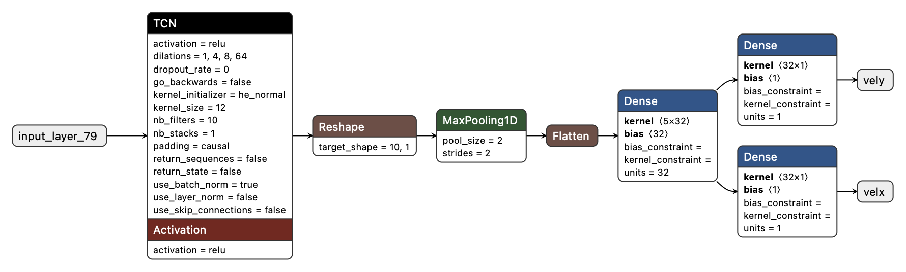
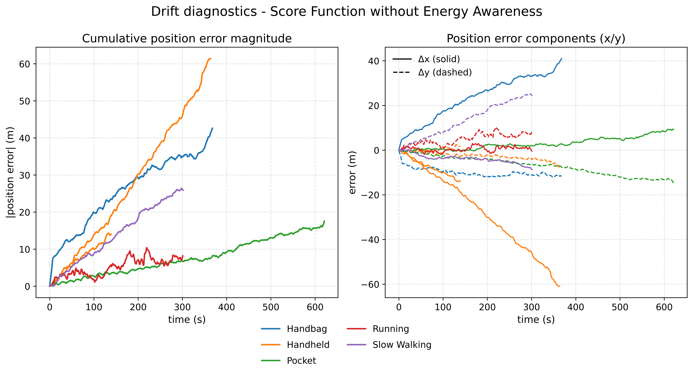
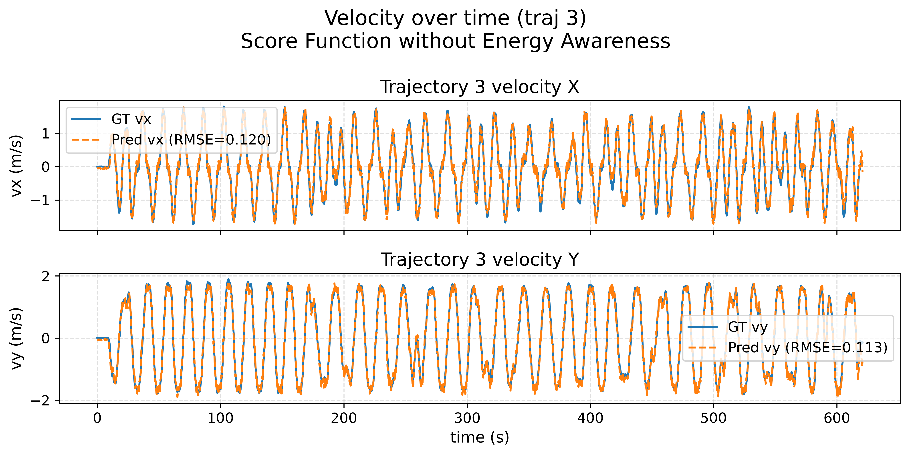
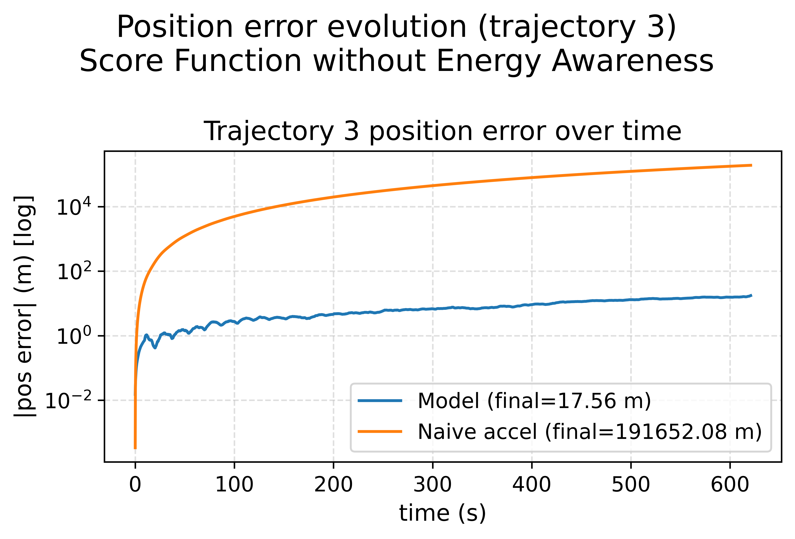
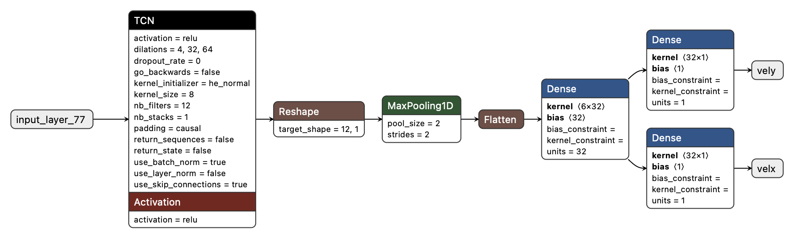
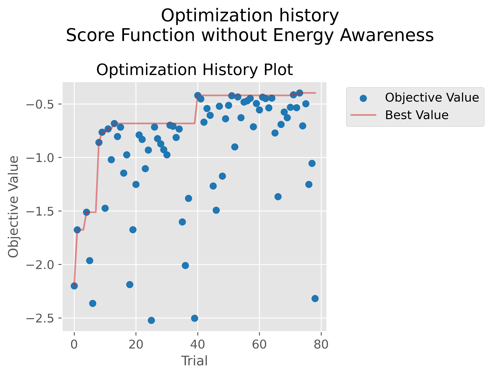
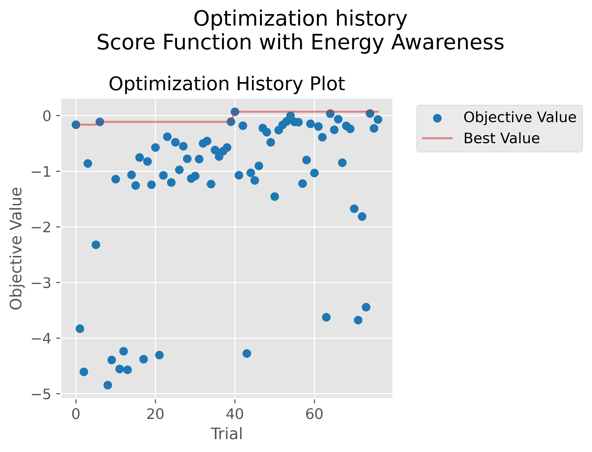
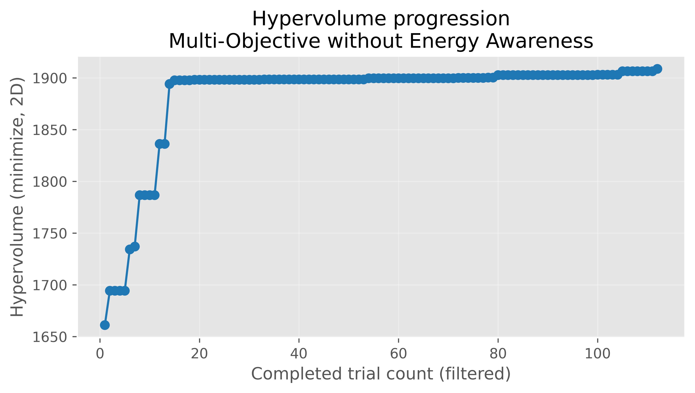

<style>
.triple-download-btn {
  display: flex;
  border: 1px solid #0366d6;
  border-radius: 6px;
  overflow: hidden;
  font-family: system-ui, -apple-system, BlinkMacSystemFont, "Segoe UI", sans-serif;
  margin: 1.5rem 0;
}

/* Each third of the button */
.triple-download-btn a {
  flex: 1;
  text-decoration: none;
  text-align: center;
  padding: 0.6rem 0.75rem;
  display: flex;
  flex-direction: column;
  justify-content: center;
  line-height: 1.1;
  cursor: pointer;
}

/* Small "download" / "view on" text */
.triple-download-btn .label-small {
  font-size: 0.7rem;
  text-transform: uppercase;
  letter-spacing: 0.05em;
  opacity: 0.8;
}

/* Big "ZIP file" / "TAR Ball" / "GitHub" text */
.triple-download-btn .label-big {
  font-size: 0.95rem;
  font-weight: 600;
}

/* Colors per segment */
.triple-download-btn a:nth-child(1),
.triple-download-btn a:nth-child(2) {
  background: #f6f8fa;
  color: #0366d6;
}

.triple-download-btn a:nth-child(2) {
  border-left: 1px solid #e1e4e8;
  border-right: 1px solid #e1e4e8;
}

.triple-download-btn a:nth-child(3) {
  background: #24292e;
  color: #ffffff;
}

/* Hover state */
.triple-download-btn a:hover {
  background: #0366d6;
  color: #ffffff;
}
</style>

<div class="triple-download-btn">
  <a href="https://github.com/Joseph-Q-Zales/ECM202A_2025Fall_Project_1/zipball/main">
    <span class="label-small">Download</span>
    <span class="label-big">ZIP file</span>
  </a>

  <a href="https://github.com/Joseph-Q-Zales/ECM202A_2025Fall_Project_1/tarball/main">
    <span class="label-small">Download</span>
    <span class="label-big">TAR Ball</span>
  </a>

  <a href="https://github.com/Joseph-Q-Zales/ECM202A_2025Fall_Project_1">
    <span class="label-small">View on</span>
    <span class="label-big">GitHub</span>
  </a>
</div>


Joseph Zales ([GitHub](https://github.com/Joseph-Q-Zales))  

---

## **Abstract**

Ultra-low-power inertial odometry is valuable in settings without GPS, but embedded deployments are tightly constrained by memory, real-time latency and energy. This report presents TinyODOM-EX, an end-to-end, energy-aware hardware-in-the-loop neural architecture search (NAS) pipeline that extends a prior TinyML inertial odometry NAS approach by modernizing the software stack, using a new optimizer to support single and multi-objective searches and including energy into the optimization process. For each candidate model, TinyODOM-EX compiles and deploys to an Arduino Nano 33 BLE Sense to measure flash, RAM, latency, and energy per inference.

## **Slides**

- [Midterm Checkpoint Slides](https://docs.google.com/presentation/d/1UtyWay7o1q8KnlKmfcb9YPXjvYXP0kHzi5wXddbCKxM/edit?usp=sharing)  
- [Final Presentation Slides](https://docs.google.com/presentation/d/1fY7CZslKuBSrHY7Z8Itt16Krfnphitx3Gw7eq5UoKaw/edit?usp=sharing)

---
# Table of Contents:
- [Table of Contents:](#table-of-contents)
- [**1. Introduction**](#1-introduction)
    - [**1.1 Motivation \& Objective**](#11-motivation--objective)
    - [**1.2 State of the Art \& Its Limitations**](#12-state-of-the-art--its-limitations)
    - [**1.3 Novelty \& Rationale**](#13-novelty--rationale)
    - [**1.4 Potential Impact**](#14-potential-impact)
    - [**1.5 Challenges**](#15-challenges)
    - [**1.6 Metrics of Success**](#16-metrics-of-success)
- [**2. Related Work**](#2-related-work)
- [**3. Technical Approach**](#3-technical-approach)
    - [**3.1 TinyODOM-EX System Architecture**](#31-tinyodom-ex-system-architecture)
    - [**3.2 Dataset and Windowing Pipeline**](#32-dataset-and-windowing-pipeline)
    - [**3.3 NAS Objective, Search Space, and Training Procedure**](#33-nas-objective-search-space-and-training-procedure)
    - [**3.4 Hardware in the Loop Measurement and Implementation**](#34-hardware-in-the-loop-measurement-and-implementation)
    - [**3.5 Key Design Decisions and Tradeoffs**](#35-key-design-decisions-and-tradeoffs)
- [**4. Evaluation \& Results**](#4-evaluation--results)
    - [**4.1 Experimental Studies and Metrics**](#41-experimental-studies-and-metrics)
    - [**4.2 Reproducing TinyODOM on BLE33 (Study 1)**](#42-reproducing-tinyodom-on-ble33-study-1)
    - [**4.3 Single-Objective Energy-Aware NAS on BLE33 (Study 2)**](#43-single-objective-energy-aware-nas-on-ble33-study-2)
    - [**4.4 Multi-Objective NAS: Accuracy vs Latency (Study 3)**](#44-multi-objective-nas-accuracy-vs-latency-study-3)
    - [**4.5 Multi-Objective NAS: Accuracy vs Energy (Study 4)**](#45-multi-objective-nas-accuracy-vs-energy-study-4)
    - [**4.6 NAS Trial Budget and Future Practical Convergence Lessons**](#46-nas-trial-budget-and-future-practical-convergence-lessons)
- [**5. Discussion \& Conclusions**](#5-discussion--conclusions)
    - [**5.1 Summary of Key Findings**](#51-summary-of-key-findings)
    - [**5.2 Lessons from Energy-Aware NAS and HIL Infrastructure**](#52-lessons-from-energy-aware-nas-and-hil-infrastructure)
    - [**5.3 Limitations and Threats to Validity**](#53-limitations-and-threats-to-validity)
    - [**5.4 Future Work**](#54-future-work)
    - [**5.5 Final Conclusion**](#55-final-conclusion)
- [**6. References**](#6-references)
- [**7. Supplementary Material**](#7-supplementary-material)
    - [**7.1. Datasets Setup and Information**](#71-datasets-setup-and-information)
    - [**7.2. Software**](#72-software)

---

# **1. Introduction**
Accurate motion estimation from inertial sensors is invaluable in GPS-denied environments (for example, indoors or underwater), but it is especially challenging on embedded platforms. Inertial measurement units (IMUs) exhibit bias and stochastic noise, and naive integration quickly accumulates drift [1]. At the same time, microcontrollers are constrained by flash, RAM, and real-time latency budgets. For many deployments, the binding constraint is energy [2]. Prior work has shown that hardware-aware neural architecture search (NAS) can produce deployable neural inertial odometry models on microcontrollers, but energy was not measured or specifically optimized for [3]. This report presents TinyODOM-EX, an end-to-end energy-aware, hardware-in-the-loop NAS pipeline that measures on-device latency and energy per inference on a real microcontroller target. Section 2 reviews relevant prior work, Section 3 describes TinyODOM-EX and objective formulation, Section 4 reports experimental results with the Arduino Nano 33 BLE Sense (BLE33) and Section 5 discusses the results. 

### **1.1 Motivation & Objective**  

The goal of inertial odometry is to estimate motion using IMU signals when external positioning infrastructure (GNSS) is unavailable or unreliable [3]. However, embedded deployments face hard resource budgets. Models must fit within limited flash and RAM, produce outputs quickly enough to support streaming updates and consume little energy per inference to be viable on batteries or harvested energy. The objective of TinyODOM-EX is to design and evaluate a hardware-aware, energy-aware NAS pipeline for inertial odometry on microcontrollers, focusing on the Arduino Nano 33 BLE Sense.

### **1.2 State of the Art & Its Limitations**  
Classical inertial navigation pipelines rely on physical modeling and probabilistic estimation. Most common variants use Kalman filtering paired with models of sensor noise and bias [4]. These approaches can be effective when the motion model and sensor characteristics are well captured, but can degrade when real-world conditions violate modeling assumptions. In practice, this forces developers to choose between lightweight filters that drift quickly and more sophisticated estimators that are difficult to tune or too expensive for small embedded targets.

Learning-based inertial odometry methods attempt to learn bias compensation and motion dynamics directly from data. There are several systems that demonstrate improved robustness compared to naive integration and hand-tuned pipelines [5, 6]. However, these approaches are developed and evaluated in settings where compute and energy are secondary concerns. Even when models are "small," practical barriers such as model conversion, operator support and runtime memory allocation prohibit these from working on resource constrained microcontrollers.

Hardware-aware NAS and TinyML toolchains aim to close this gap by searching for architectures under embedded constraints and by integrating with deployable runtimes. TinyODOM is a clear example of this direction for inertial odometry on microcontrollers [3]. TinyODOM optimized for latency, accuracy and memory thresholds. Energy is a metric that ultimately determines the lifetime and feasibility for battery-powered and energy-harvesting systems, yet it is rarely included as a first-class objective measured on a real device. TinyODOM-EX targets this gap by adding energy-per-inference measurement (via external instrumentation) in the NAS loop to expose the accuracy-latency-energy trade space.

### **1.3 Novelty & Rationale**  

To the best of our knowledge, this is the first work to incorporate direct hardware-in-the-loop energy measurements into the Neural Architecture Search (NAS)  loop for microcontroller-class inertial odometry. While prior work like TinyODOM demonstrated the feasibility of finding lightweight models, they relied on proxy metrics like latency and FLOPs or simulated constraints [3]. This leaves a gap where a model might be fast, but energy inefficient due to peripheral usage or memory access patterns.

We address this by physically instrumenting the BLE33, measuring the exact joules consumed per inference. Furthermore, we modernized the engineering stack by refactoring the original notebook-based workflow into a modular client–server architecture built around TensorFlow 2 and Optuna [7, 8]. This modularization is intended to improve reproducibility and make it easier to extend experiments to new hardware targets

### **1.4 Potential Impact**  

The impact of this work extends beyond the specific task of inertial odometry:
- **Modular Reusability**: By separating data preparation, search logic and hardware control, we enable other researchers to reuse individual components (such as the HIL energy server) without needing to adopt the entire inertial pipeline.
- **Extendible Device Support**: The system isolates hardware-specific logic in key functions. This structure enables the HIL backend to be adapted to additional targets (for example, ESP32-class devices or platforms with dedicated NPUs).
- **Reference Architecture**: By providing the code for this project, we have created a reference architecture for integrating widely used tools like Optuna, TFLite Micro and the Arduino-CLI into a cohesive automated workflow. This could serve as a blueprint for future studies aiming to also treat energy as a first-class optimization metric. 

### **1.5 Challenges**  
While TinyODOM-EX’s technical goal is straightforward, implementing an end-to-end hardware-aware NAS loop exposed several practical challenges in system integration and experimental reliability. First, early experiments included the Arduino Nano RP2040 as a target. However, under repeated upload cycles, it would fail to re-enter the bootloader mode (BOOTSEL) without manual intervention, preventing it from being used unattended. As a result, the final studies focus on the Arduino Nano 33 BLE Sense, with RP2040's limitations documented as a negative result and a driver for future design choices (see [Section 3.5.3](#353-dropping-the-arduino-nano-rp2040-target-from-final-studies) for details and a plausible fix).

Second, TinyODOM-EX required modernizing a large portion of the software and and toolchain while trying to maintain the same behavior as the previous work, TinyODOM [3]. This included upgrading the Python and TensorFlow stacks and adopting the Arduino CLI toolchain (see [Section 3](#3-technical-approach) for details). Ensuring consistency quickly became non-trivial as the amount of code needing to change grew rapidly. Due to these changes, unit tests were created to help deal with some of the more finicky changes. 

Third, debugging became inherently cross-layered and often took place across both the GPU server and the HIL machine. Many unexpected failures only appeared in the middle of long NAS runs, where the study state had to be compared with the program logs, Arduino CLI build output and telemetry from the device. This motivated more structured logging and error handling so that failures could be diagnosed quickly

### **1.6 Metrics of Success** 
We evaluate TinyODOM-EX using three criteria for success: quantitative model performance, system-level robustness and the clarity of the resulting design tradeoffs.
- *Quantitative metrics*: Model accuracy on the OxIOD dataset using the velocity RMSE, along with embedded deployment metrics like latency per inference, energy per inference and memory footprint (flash/RAM) on the Arduino 33 BLE Sense [8]
- *System-level robustness*: Stable unattended HIL runs across many NAS trials without manual intervention or board recovery
- *Result clarity*: clear visualization of the accuracy-memory-latency-energy tradeoffs (including Pareto Fronts)

---

# **2. Related Work**

Learning-based inertial odometry methods aim to estimate motion directly from IMU signals by learning sensor bias compensation and motion dynamics from data. Often this improves robustness relative to naive integration and hand-tuned filtering pipelines [5, 6]. Public datasets such as OxIOD have enabled standardized evaluation by providing synchronized IMU streams with high-quality ground truth across multiple carrying modalities [8]. For microcontroller deployment, TinyODOM is the closest predecessor to this project. It uses hardware-aware NAS to discover Temporal Convolutional Networks (TCNs) deployable inertial odometry models under memory and latency constraints on MCU-class targets [3, 9]. However, energy per inference is not measured or treated as a first-class optimization objective, despite being a binding constraint for many battery-powered and energy-harvesting deployments [2].

More broadly, hardware-aware TinyML and NAS workflows constrain architectures to meet flash, RAM, and latency limits and leverage deployable runtimes such as TensorFlow Lite Micro [10, 11]. These methods often rely on proxies (for example FLOPs, parameter count, or measured latency) rather than direct energy measurements, and latency is not guaranteed to uniquely determine energy across devices and workloads. TinyODOM-EX builds on these foundations by adding closed-loop hardware-in-the-loop energy per inference measurement to the NAS loop, and by using Optuna to support both single-objective scoring studies and multi-objective Pareto-front analyses over accuracy, latency, and energy [8].

---

# **3. Technical Approach**

TinyODOM-EX automates the discovery of energy-efficient inertial odometry models by integrating physical hardware measurements directly into the neural architecture search loop. The system operates in a cycle where a black-box optimizer suggests candidate Temporal Convolutional Network (TCN) architectures based on high-level hyperparameters. These candidates are trained on a GPU, automatically compiled and deployed to an embedded target (Arduino Nano 33 BLE Sense) to verify real-world latency and energy consumption. This hardware-grounded feedback allows the search algorithm to poorly score models that violate real-time constraints or exceed energy budgets. To ensure reproducibility and scalability, we implemented the system as a modular architecture comprising a GPU-based NAS client, a hardware-in-the-loop (HIL) server, and a centralized configuration system.

### **3.1 TinyODOM-EX System Architecture**
<figure style="text-align: left">
  
  <figcaption style="font-size: 0.9em; color: #555; margin-top: 4px;">
    <strong>Figure 3.1</strong> High-level system partition for TinyODOM-EX. The GPU server runs Optuna NAS and model training, while the HIL computer converts candidates to TensorFlow Lite Micro, compiles and uploads firmware to the device under test (Arduino Nano 33 BLE Sense). The DUT is powered through an inline INA228 monitor, enabling external energy measurement; the HIL pipeline returns compiled flash/RAM, on-device latency, and measured energy to the NAS loop.
  </figcaption>
</figure>

TinyODOM-EX refactors the legacy jupyter-notebook-style workflow into a modular pipeline with specific GPU-side and hardware-side responsibilities. As summarized in Figure 3.1, the NAS client runs on a GPU server and handles neural architecture search and training, while a separate hardware-in-the-loop (HIL) machine is responsible for conversion, compilation, deployment, and on-device measurement. The system can run in a two-machine configuration (GPU server plus local HIL host) or a single-machine configuration when the GPU host has physical access to the DUT. Communication between the GPU and HIL servers uses the ZeroMQ (ZMQ) library in a request-reply (REQ-REP) client/server pattern [12].

#### **3.1.1 Per-trial Workflow**
<figure style="text-align: left">
  
  <figcaption style="font-size: 0.9em; color: #555; margin-top: 4px;">
    <strong>Figure 3.2</strong> Per-trial workflow for TinyODOM-EX. Each trial trains and evaluates a candidate model on the GPU server, then exports to TFLite Micro, compiles and uploads firmware via Arduino CLI, and measures on-device metrics in the HIL loop. Trials may terminate early when candidates are infeasible or are pruned.
  </figcaption>
</figure>

Figure 3.2 expands the system overview by showing the end-to-end steps executed for a single trial. Each Optuna trial corresponds to one sampled candidate architecture. The NAS client (the GPU server) sends the HIL server (the HIL machine) the hyperparameters, which are then built into a TensorFlow model, converted into a TensorFlow Lite Micro model, and compiled via the Arduino CLI [13]. The CLI returns the compiled RAM and flash sizes needed for this model. 

At this point, the system optimizes the tensor arena size. The arena is a statically allocated buffer used by TensorFlow Lite Micro to hold activation tensors and scratch space at runtime [11]. It is either stepped up or down in size depending on if the model will fit on the board. If TensorFlow Lite Micro cannot allocate tensors within the maximum allowable arena, the trial is pruned immediately to avoid the expensive flashing and training steps. If the arena search is exhausted, the trial stops there and is pruned so that the expensive step of uploading and model training is avoided. If an ideal arena size can be found, the model is uploaded to the DUT and inference is run with 10 windows. This differs from TinyODOM, which ran inference on only a single window [C14]. By averaging the latency per window (and energy per inference when the INA228 measurement path is enabled) across 10 windows, the startup cost is amortized and the true latency and energy per inference can be better determined. The latency per inference, the energy per inference, RAM and flash size is then passed back to the GPU server in the ZMQ response. The GPU server then trains the candidate model and all of the metrics are returned to the NAS and incorporated into the study objective. After receiving these hardware-grounded metrics, the GPU server trains the same candidate architecture and evaluates it on the validation split, then incorporates both validation accuracy and the returned hardware metrics into the study objective.

#### **3.1.2 Configuration**
TinyODOM-EX replaces hard-coded constants in the legacy notebook with a YAML configuration file (`nas_config.yaml`) that captures device settings, dataset parameters, training budgets, etc. This configuration file is shared between the GPU server and the HIL machine. At the end of the study, this configuration is copied into the study output directory so that each run is self-describing and can be reproduced. 

### **3.2 Dataset and Windowing Pipeline**

<figure style="text-align: left">
  
  <figcaption style="font-size: 0.9em; color: #555; margin-top: 4px;">
    <strong>Figure 3.3</strong> OxIOD collection environment and example device placements (handheld, pocket, handbag, trolley) within the Vicon motion-capture room. This motivates the modality diversity used in TinyODOM-EX and the availability of high-quality ground truth for evaluation [8].
  </figcaption>
</figure>

Similar to TinyODOM, this project uses the Oxford Inertial Odometry Dataset (OxIOD) as the base inertial odometry corpus [3, 8]. OxIOD is a publicly available smartphone-based IMU dataset collected in a Vicon motion-capture room (approximately 4x5m) to provide high-quality ground truth aligned with IMU measurements [8]. In TinyODOM-EX, we use the same six modalities used by TinyODOM: handbag, handheld, pocket, running, slow walking and trolley [3, 14]. Figure 3.3 comes from the OxIOD paper and illustrates four of the modalities they collected.

#### **3.2.1 Data Split**

<figure style="text-align: left">
  
  <figcaption style="font-size: 0.9em; color: #555; margin-top: 4px;">
    <strong>Figure 3.4 </strong> Example OxIOD handheld sequence (first 120 seconds) visualized using Vicon ground truth. The trajectory illustrates the small-room operating envelope and the continuous nature of each sequence.
  </figcaption>
</figure>

Like TinyODOM, we split OxIOD at the sequence (file) level rather than the window level. This avoids the leakage that would occur if highly overlapping windows from the same underlying trajectory were distributed  across the train, validation and test sets. Each modality folder contains text files (`Train.txt`, `Valid.txt`, `Test.txt`) which list which trajectories belong to each split. TinyODOM-EX includes a script to generate this directory structure and split files after downloading OxIOD. This script is called `prepare_oxiod.py` and is located in the dataset_download_and_splits folder. 

In this work, we used 71 trajectories in total, matching the trajectory count used by the TinyODOM reference implementation [14]. We partition these into 50 training, 14 validation, and 7 test trajectories to approximate a 70/20/10 split. This differs from TinyODOM which used a 85/5/10 split [3]. Our motivation for using a larger validation split in TinyODOM-EX is that we explicitly train against validation loss during the NAS while the TinyODOM reference implementation trains with `model.fit` on the training data only (checkpointing on training loss) and then evaluates on the validation set after training. Whereas TinyODOM-EX passes the validation data into `model.fit`, checkpoints on the validation loss and applies early stopping during the neural architecture search based on the validation loss [14]. Figure 3.4 illustrates the first 120 seconds of a handheld trajectory in the validation split. 

#### **3.2.2 Data Processing**

The OxIOD data loader in TinyODOM-EX is adapted directly from the TinyODOM reference implementation to keep processing behavior consistent [14]. Each IMU sequence is converted into a set of overlapping fixed-length windows using a sliding window size and stride length defined in the configuration file. The dataloader constructs three-axis acceleration by combining the provided linear acceleration and gravity estimates, concatenates the three-axis gyroscope and optionally includes the magnetometer channels and a step-indicator. The step indicator, which is also optionally used in TinyODOM, applies a pedometer library to the acceleration stream and produces a binary channel marking detected step locations. Ground truths were also computed over each window based on the Vicon positions [14]. For all experiments reported here, both the magnetometer and step-indicator channels were used. 

Similar to TinyODOM, the window size for these studies was 200 samples [3]. This corresponds to a 2 second window. Unlike TinyODOM, which used a 10 sample stride, we used a 20 sample stride [14]. This produces a new window every 200 ms (a 5 Hz update rate), increasing the allowable per-inference latency to maintain a real-time streaming target. This was specifically changed to give more time for inference for each window to allow for better accuracy while still remaining real-time. This is especially evident when looking at the accuracy-latency Pareto front plot in [Section 4.4.1](#441-pareto-front-and-convergence).

### **3.3 NAS Objective, Search Space, and Training Procedure**

This report uses the same terminology for experimentation as Optuna. A "study" refers to a full Optuna run with an objective, and a trial refers to one architecture and its resulting training, validation and hardware measurements [8]. TinyODOM-EX supports both single-objective (optimization with a scoring function) and multi-objective studies, with the configuration file controlling which type is run and whether energy is included in the optimization. 

TinyODOM-EX's NAS searches over hyperparameters for a temporal convolution network that maps the windowed inertial inputs to velocity (x and y) outputs. The search space is derived from the TinyODOM TCN design, while extending evaluation to incorporate hardware-grounded constraints *and* measured energy [3]. Across the full set of sampled hyperparameters (detailed in Table 3.1) for TinyODOM-EX, the search space spans approximately 8 million candidate combinations. 

<figure style="text-align: left">
  <figcaption style="font-size: 0.9em; color: #555; margin-bottom: 4px;">
    <strong>Table 3.1.</strong> Hyperparameter search space summary for the TinyODOM-EX TCN family. The table lists the tunable parameters available to Optuna. These parameters are the same as in TinyODOm [3].
  </figcaption>
</figure>

| Hyperparameter       | Range                          | What it does                                             |
| -------------------- | ------------------------------ | -------------------------------------------------------- |
| nb_filters           | 2 to 63                        | Controls model width / capacity                          |
| kernel_size          | 2 to 15                        | Temporal receptive field per layer                       |
| dropout_rate         | 0 to 1 (discretized every 0.2) | Regularization                                           |
| use_skip_connections | T/F                            | Residual or plain blocks                                 |
| norm_flag            | T/F                            | Normalization                                            |
| dilations            | Categorical (465 options)      | Pattern of dilation across layers (e.g., [1, 4, 16, 32]) |

The hyperparameters in Table 3.1 jointly influence not only the accuracy of the model (RMSE), but also the feasibility of deployment to the target due to the flash/RAM constraints.

#### **3.3.1 Objective Functions**
For single objective studies, TinyODOM-EX uses a score function that combines the validation accuracy, memory usage, latency and energy per inference (see Eq. 1). Accuracy is computed from the validation RMSE on the predicted velocity components. Memory terms are computed from the reported flash and RAM usage (returned by the HIL pipeline). Even though latency was included as a metric in TinyODOM, we chose to change how the penalty was calculated. In TinyODOM, the latency penalty was a scalar multiplied by the latency in milliseconds [14]. We found that this was challenging to tune and decided to instead compare the latency to the real-time budget and only apply the latency penalty when the measured latency exceeded the budget. The budget is derived based on the sampling rate and stride length. We also decided to clamp that penalty to a maximum of 2 in order to keep the scores reasonable (see Eq. 2). When energy is enabled (based on the config), the score penalizes candidates whose measured energy exceed a target. In our experiments, we chose to use 10 mJ as our target. Note that unlike the latency penalty, the energy penalty acts as a bonus if the power consumption is below the target.


<figure style="text-align: left">
  
  
</figure>

#### **3.3.2 Training and Pruning**
To get the accuracy metric, each trial trains for a minimum of 40 epochs and a maximum of 50 epochs (based on an early stopping system). The early stopping is based on the validation loss. Additionally, to keep studies accurate, Optuna can prune trials early. For our studies, this only happened when the arena was exhausted, however, if there was a different error code thrown, it would also prune the trial. This is different from TinyODOM's Mango optimizer. TinyODOM set models that wouldn't work to -5 (a number more negative than their typical scores) [3]. For multi-objective studies, Optuna does not support pruning, so the objectives under test were given large constants and the trials were removed upon completion. 

### **3.4 Hardware in the Loop Measurement and Implementation**
<figure style="text-align: left">
  
  <figcaption style="font-size: 0.9em; color: #555; margin-top: 4px;">
    <strong>Figure 3.5</strong>  Physical HIL setup for TinyODOM-EX. The Arduino Nano 33 BLE Sense is powered through an inline Adafruit INA228 breakout, enabling external energy measurement during inference. The DUT also configures and reads the INA228 over I2C. Telemetry is returned to the host over USB serial.
  </figcaption>
</figure>

<figure style="text-align: left">
  
  <figcaption style="font-size: 0.9em; color: #555; margin-top: 4px;">
    <strong>Figure 3.6</strong>  Wiring diagram for the TinyODOM-EX HIL setup. USB D+/D− and GND connect directly to the BLE33 for serial telemetry, while the USB 5 V supply is routed through the INA228 shunt (Vin+ → Vin−) to measure current and energy. The BLE33 powers the INA228 logic from its 3.3 V rail and configures/reads the INA228 over I2C (SDA/SCL).
  </figcaption>
</figure>

As shown in Figures 3.5 and 3.6, TinyODOM-EX instruments energy by inserting an Adafruit INA228 power monitor inline with the DUT supply rail, while leaving the USB data lines (D+/D−) untouched for serial telemetry. The USB 5V supply is routed into the INA228 V<sub>in</sub>+ terminal, and the DUT is powered from the INA228 V<sub>in</sub>- terminal so that the on-board 15 mΩ shunt is in series with the DUT [15]. This configuration allows the system to report energy per inference based on the accumulated, directly measured energy instead of relying solely on proxy metrics such as FLOPs. 

A deliberate simplification in TinyODOM-EX is that the DUT configures and reads the INA228 over I2C instead of delegating that to a second "harness" MCU. This reduces coordination complexity. However, this means that the reported energy overhead includes the INA228. According to the INA228's datasheet, the supply current is approximately 0.64 mA, which corresponds to about 2.1 mW power draw at its 3.3 V logic rail [16].

TinyODOM-EX uses a TensorFlow Lite Micro inference harness to benchmark the candidate models on the Arduino Nano 33 BLE Sense. The harness initializes the TFLM interpreter, allocates the fixed arena, loads the candidate models and runs repeated inferences on a set of input windows. To reduce the influence of setup and measurement jitter, energy and latency are averaged.

Finally, to support both energy-aware and latency-only studies without manual code edits, TinyODOM-EX maintains two Arduino sketches:
1. `tinyodom_tcn_energy.ino`, which enables the INA228-based energy measurement and reports energy, power, current, voltage and latency.
2. `tinyodom_tcn_no_energy.ino`, which omits the INA228/I2C setup and reports just latency.

This split is because the INA228/I2C libraries take up memory headroom on the board. The HIL server selects the appropriate sketch at runtime based on the YAML configuration and copies it into the build directory.

After execution, the sketch prints the telemetry over serial. The HIL computer parses this output using regex and returns the parsed metrics to the NAS client for incorporation into the study (see [Section 3.3](#33-nas-objective-search-space-and-training-procedure) for details).


### **3.5 Key Design Decisions and Tradeoffs**
As TinyODOM-EX evolved from the original TinyODOM reference workflow into an end-to-end hardware-aware NAS system, the primary challenges shifted from model design to system integration and experimental reliability. In particular, maintaining reproducible studies and debuggable code while repeatedly converting, compiling, flashing, and measuring candidate models required several architectural and tooling choices. The remainder of this section documents the key decisions and the tradeoffs they introduced.

#### **3.5.1 Optuna-based NAS instead of Mango**
TinyODOM used Mango as its tuner, but TinyODOM-EX is built around Optuna instead because it better matched the project's needs once the hardware-in-the-loop constraints and need for multi-objective studies was introduced. Mango is positioned as a Python library for parallel hyperparameter tuning based on Bayesian optimization, with emphasis on abstraction, flexibility and fault-tolerant execution. Those are strong properties for scaling optimization, and they generally align with the needs of a NAS-style workflow [17].

However, TinyODOM-EX required two capabilities that were central: a path to multi-objective search in order to create Pareto Frontiers and practical mechanisms to terminate infeasible trials to reduce experiment time.
Optuna provided both single-objective Bayesian optimization via TPE sampling, and a multi-objective mode using an NSGA-II sampler, both of which are used by TinyODOM-EX [8]. Additionally, Optuna has built out a library of visualization and storage/logging functions. In fact, Figure 4.12 in [Section 4.5.2](#452-energy-oriented-hyperparameter-structure) was created using Optuna's visualization utilities.

#### **3.5.2 Separate Energy-instrumented and Latency-Only Firmware**
TinyODOM-EX maintains two Arduino measurement sketches as described in [Section 3.4](#34-hardware-in-the-loop-measurement-and-implementation) above. The motivation is a direct resource tradeoff on the microcontroller. The INA228's measurement support (I2C libraries and device drivers) increases the flash and RAM usage, which can reduce the maximum feasible model size. To avoid artifically constraining the search space in studies when energy is not being optimized, the latency-only sketch omits the INA228 setup and only reports timing. In the future, if a second harness board runs the DUT, this will no longer be an issue.

#### **3.5.3 Dropping the Arduino Nano RP2040 Target From Final Studies**
TinyODOM-EX initially targeted using multiple boards, but the final set of experiments focus solely on the Arduino Nano 33 BLE Sense because the RP2040 path did not meet the reliability requirement for an unattended NAS study.Under repeated compile-flash-measure cycles, the RP2040 required manual intervention to push the program button and re-enter the bootloader state, which was infeasible for long running studies. In fact, in our setup, the board was only ever able to be programmed once before needing to be reset manually. 

There was a practical tradeoff here: excluding the RP2040 meant that there was no comparison of hardware targets in the final results. However, the benefit is that by avoiding needing to run single-objective scoring studies with the RP2040, there was time to run additional multi-objective studies which yielded great results (as described in the next section).

A plausible mitigation for a future RP2040-based NAS run is to automate the recovery. We found community documentation from others in the community that also struggled with this on the RP2040 and they recommend using a secondary RP2040 (or other MCU) as a debug probe and controlling the reset behavior via the RUN pin to recover from hard faults without human interaction. Using a Pico as a probe is documented and widely used (often referred to as a "Picoprobe"), and the RUN pin can be used to reset the RP2040 by pulling it low [18, 19].

#### **3.5.4 Modular Refactor and YAML Configuration**
Finally, TinyODOM-EX's refactor from a monolithic, jupyter-notebook workflow into a NAS client, HIL server, utility functions across multiple files and a centralized YAML configuration was a deliberate design choice to improve reproducibility and operational reliability. The YAML file allows the study to be self-describing, and studies can easily be analyzed without worrying that hardcoded parameters had changed between runs. Additionally, by moving into individual python files, it allowed for unit tests to be written and bugs to be caught using those prior to expensive mistakes mid-study. The downside of this approach was higher upfront cost and a more complex code layout than a single script. This new modular system means that in the future, a new compile and upload chain could be used to bring a new board from a different manufacturer without needing to change the entirety of the code.

---

# **4. Evaluation & Results**

We report the experimental results of TinyODOM-EX across four neural architecture search studies on the Arduino Nano 33 BLE Sense (BLE33). All studies used the same model search space, training procedure, data splits, and hardware-in-the-loop (HIL) measurements described in [Section 3](#3-technical-approach). Results are reported in terms of prediction accuracy, deployability on the device under test and the practical tradeoffs between accuracy and on-device costs.


### **4.1 Experimental Studies and Metrics**

TinyODOM-EX evaluates four Optuna-based NAS studies that differ only in the optimization objective, while keeping the dataset, training loop, model family and deployment process fixed. Studies 1 and 2 use a single scalar score function that combines accuracy with on-device constraints. Studies 3 and 4 use multi-objective optimization to expose the tradeoffs, producing Pareto frontiers instead of a single "best" model. Table 4.1 summarizes the four studies below.

<figure style="text-align: left">
  <figcaption style="font-size: 0.9em; color: #555; margin-bottom: 4px;">
    <strong>Table 4.1</strong> Study composition.
  </figcaption>
</figure>

| Study | Objective formulation                    | Hardware measurements used              | Trials |
| ----: | ---------------------------------------- | --------------------------------------- | -----: |
|     1 | Single-objective, non-energy-aware score | Latency, RAM, flash                     |     75 |
|     2 | Single-objective, energy-aware score     | Latency, energy, RAM, flash             |     75 |
|     3 | Multi-objective, accuracy vs latency     | Latency                                 |    135 |
|     4 | Multi-objective, accuracy vs energy      | Energy per inference                    |    135 |


### **4.2 Reproducing TinyODOM on BLE33 (Study 1)**

Study 1 establishes the baseline TinyODOM-EX reproduction of the TinyODOM model on the BLE33 using the single-objective non-energy-aware scoring function. Section 4.2.1 defines the selected baseline model and section 4.2.2 uses the qualitative trajectory plots to show how small errors translate into integrated position drift.

#### **4.2.1 Baseline Model and Deployment Profile**

We define the Study 1 baseline model as the best-scoring fully completed trial under the single-objective scoring function.

In the table below, two families of accuracy metrics are reported. First is the velocity RMSE (m/s) which evaluates the model in the same space that it predicts. This is the most direct measure of its capabilities and is included in how the model is scored (see [Section 3.3](#33-nas-objective-search-space-and-training-procedure) for details). The second family is ATE (Absolute Trajectory Error) and RTE (Relative Trajectory Error), computed from the position tracks obtained by integrating the window-level velocity predictions over time using the same `Cal_TE` evaluation used by TinyODOM [14]. Using the same function enables a like-for-like comparison, even though the hardware and deployment toolchains differ. These metrics evaluate how well the model tracks the position estimate found by integrating the velocities over time. ATE summarizes the end-to-end trajectory deviation (i.e. how far the integrated position estimate departs from the ground truth over the full sequence). RTE summarizes local drift (i.e. the error in relative motion over shorter horizons) and is typically less sensitive to long-horizon error accumulation than ATE [20].

<figure style="text-align: left">
  <figcaption style="font-size: 0.9em; color: #555; margin-bottom: 4px;">
    <strong>Table 4.2</strong> Baseline (Study 1) best model summary on BLE33.
  </figcaption>
</figure>

| Metric                                |     Value |
| ------------------------------------- | --------: |
| Scalar score                          |      -0.4 |
| Velocity RMSE (x)                     |     0.203 |
| Velocity RMSE (y)                     |     0.204 |
| Latency per inference                 |  154.5 ms |
| RAM (Arduino-CLI, globals)            |     98 kB |
| Flash (Arduino-CLI, total sketch)     |    379 kB |
| TFLite model size                     |   41.7 kB |
| FLOPs                                 |    4.17 M |
| Test ATE (median Test trajectories)   |    4.71 m |
| Test RTE (median Test trajectories)   |    1.53 m |


<figure style="text-align: left">
  
  <figcaption style="font-size: 0.9em; color: #555; margin-top: 4px;">
    <strong>Figure 4.1</strong>  Architecture diagram of the selected Study 1 baseline model (TinyODOM-like), as deployed on the BLE33. The model consists of a compact TCN front end followed by small dense heads for v<sub>x</sub> and v<sub>y</sub>. The diagram highlights the key selected architectural knobs, such as nb_filters = 10 and kernel_size = 12.
  </figcaption>
</figure>

The measured latency and memory footprint indicate that the selected baseline is deployable on the BLE33 under the 200 ms real-time budget used in this report. The velocity RMSE can still look good while the position drift increases because the integration amplifies the small bias and error. ATE captures longer-horizon errors, while RTE captures shorter horizon errors. This is why the remainder of this section pairs velocity plots with drift and integrated position plots instead of treating the velocity RMSE as sufficient evidence of a working model.

<figure style="text-align: left">
  <figcaption style="font-size: 0.9em; color: #555; margin-bottom: 4px;">
    <strong>Table 4.3.</strong> TinyODOM paper results for OxIOD [3]. This table is provided for context and model-level comparison. Note, TinyODOM's configuration uses a stride of 10, while this work uses a stride of 20.
  </figcaption>
</figure>

| Method / Target                                           | SRAM (kB) | Flash (kB) | FLOPs (M) |  ATE (m) |  RTE (m) |
| --------------------------------------------------------- | --------: | ---------: | --------: | -------: | -------: |
| TinyODOM (STM32F446RE) [1]                                |      52.4 |       71.6 |      4.64 |     3.30 |     1.24 |
| TinyODOM (STM32L476RG) [1]                                |      72.5 |       89.6 |      6.65 |     3.59 |     1.37 |
| TinyODOM (STM32F407VET6) [1]                              |      90.1 |      117.6 |      8.92 |     6.82 |     1.28 |
| TinyODOM (STM32F746ZG) [1]                                |      55.5 |       71.0 |      4.92 |     2.80 |     1.26 |
| **This work (BLE33, Study 1 baseline, median over test)** |    **98** |    **379** |  **4.17** | **4.71** | **1.53** |


The flash and RAM values reported for TinyODOM-EX appear large compared to Table 4.3 because the Arduino CLI summary reflects the entire firmware image. This includes the TFLM runtime code, operator kernels, sensor I/O, and the underlying MBED RTOS overhead.Additionally, the RAM number includes the statically allocated arena (see [Section 3.1](#31-tinyodom-ex-system-architecture) for details on the arena). Because the arena is statically allocated, the reported RAM number provides a conservative view of the memory. The flash cost for the embedded model data is likely much closer to the TFLite model size (41.7 kB). Since TinyODOM does not specify if their metrics include runtime overhead, a direct numerical comparison may be inexact.

However, we can compare the architectures of these models. For example, our baseline model uses slightly fewer FLOPs than any of those reported by TinyODOM. It is therefore not surprising that the median ATE and RTE values are higher. The key takeaway is that these numbers are still in family.

#### **4.2.2 Qualitative baseline evaluation**

<figure style="text-align: left">
  
  <figcaption style="font-size: 0.9em; color: #555; margin-top: 4px;">
    <strong>Figure 4.2</strong> Integrated position drift across the test split from the Study 1 baseline. Left: cumulative position error magnitude over time. Right: position error components in x (solid) and y (dashed).
  </figcaption>
</figure>

Figure 4.2 provides a modality-level view of how integrated position error drift accumulates over time. This plot highlights the limitation of a seven-trajectory test split. Given the diversity between modalities and the fact that there is only one trajectory per modality in the test split, it is difficult to isolate whether error stems from the modality itself or the specific trajectory. Several of the trajectories exhibit steadily increasing drift. Trajectory 3 (Pocket) stands out as both the longest evaluated sequence in the test split and one of the lowest error accumulations at the end of the horizon. This combination makes it useful as the model trajectory and the remaining plots in this subsection will make use of it. 

<figure style="text-align: left">
  
  <figcaption style="font-size: 0.9em; color: #555; margin-top: 4px;">
    <strong>Figure 4.3</strong> Velocity prediction over time for Trajectory 3 (Pocket), showing ground-truth versus predicted v<sub>x</sub> and v<sub>y</sub>. Per-axis RMSE on this trajectory is 0.12 m/s for v<sub>x</sub>  and 0.113 m/s for v<sub>y</sub>. 
  </figcaption>
</figure>

Figure 4.3 shows the model outputs in the same space the network predicts. The predicted waveforms track the structure in both axes with relatively small residual error, including good alignment on the major peaks and troughs through the sequence. This behavior is consistent with the aggregate velocity RMSE reported in Table 4.1.

<figure style="text-align: left">
  
  <figcaption style="font-size: 0.9em; color: #555; margin-top: 4px;">
    <strong>Figure 4.4</strong> Trajectory 3 position overlay comparing ground truth, the model-integrated trajectory, and a naive acceleration baseline formed by raw double integration. The model-integrated trajectory achieves an ATE = 7.69 m, while the naive acceleration baseline diverges by serveral orders of magnitude (ATE=63,897.98 m).
  </figcaption>
</figure>

<figure style="text-align: left">
  
  <figcaption style="font-size: 0.9em; color: #555; margin-top: 4px;">
    <strong>Figure 4.5</strong> Trajectory 3 position error evolution on a logarithmic scale comparing the model-integrated trajectory against the naive acceleration baseline.
  </figcaption>
</figure>

Figure 4.4 illustrates the the central caveat to inertial odometry, that small velocity errors can accumulate into noticeable position drift, even when the velocity traces look well aligned. The model-integrated path deviated from the ground truth over time, but it remains dramatically more stable than the naive double integration of the raw acceleration. The log-scale error plot (Figure 4.5) makes that separation clear, with over four orders of magnitude improvement in the final position error vs the naive baseline.

### **4.3 Single-Objective Energy-Aware NAS on BLE33 (Study 2)**

Study 2 tests whether energy measurement is necessary to guide NAS on the BLE33. We run two otherwise identical single-objective studies (75 trials each): one without energy logging and one with an INA228-based energy-per-inference penalty. Each trial is scored with a scalar objective that combines accuracy, memory, and on-device constraints. See [Section 3.3](#33-nas-objective-search-space-and-training-procedure) for details on the score function. Section 4.3.1 compares how the score components shift with energy logging, and Section 4.3.2 quantifies the empirical energy–latency relationship on this target.

#### **4.3.1 Effect of Energy Logging on NAS Outcome**

<figure style="text-align: left">
  <figcaption style="font-size: 0.9em; color: #555; margin-bottom: 4px;">
    <strong>Table 4.4</strong> Heuristic contributions of each term to the absolute scalar score for the single-objective NAS runs on BLE33 (75 trials each). The score combines accuracy, resource usage, latency, and optional energy penalties.
  </figcaption>
</figure>

| Term            | No-energy score (%) | Energy-aware score (%) |
|-----------------|---------------------|------------------------|
| `model_acc`     | 77.4                | 55.1                   |
| `latency_term`  | 21.9                | 9.9                    |
| `energy_term`   | --                  | 34.7                   |
| `resource_term` | 0.7                 | 0.4                    |


Table 4.4 compares how the scalar score is distributed across components in the no-energy and energy-aware single-objective runs on BLE33. In the no-energy setting, the score is dominated by the accuracy term: the model accuracy term accounts for about 77% of the absolute score, the latency penalty contributes roughly 22%, and the resource term is negligible. When energy measurements are enabled, the energy penalty becomes a first-class objective and takes about 35% of the score magnitude. The share of model accuracy term drops to roughly 55% and the latency contribution falls below 10%, while the resource term remains insignificant.

The mean model accuracy value becomes slightly more negative in the energy-aware run, indicating a modest loss in validation accuracy as the optimizer trades off some performance for lower energy per inference. The mean latency penalty remains almost unchanged between the two runs, which is consistent with the BLE33 latency budget being satisfied by most trials in both cases. Overall, these statistics confirm that enabling the energy term rebalances the single-objective score toward energy per inference without turning it into a pure energy minimization problem: accuracy still carries the largest weight, but energy now plays a comparable role to latency in shaping the search.


#### **4.3.2 Empirical Relationship Between Energy and Latency**

A central question in TinyODOM-EX is whether energy must be modeled and optimized, or whether latency alone is a sufficient proxy on the BLE33. Adding energy awareness increases system complexity and adds an additional source of experimental variance. This section quantifies how tightly energy per inference and latency per inference are coupled in practice. 

<figure style="text-align: left">
  
  <figcaption style="font-size: 0.9em; color: #555; margin-top: 4px;">
    <strong>Figure 4.6</strong> Empirical mapping of energy and latency on the BLE33 across measured trials. Left: energy per inference versus latency with a least-squares linear fit. Right: average power versus latency, computed as energy divided by latency.
  </figcaption>
</figure>

Figure 4.6 (left) shows a near-linear relationship between energy per inference and latency across the measured trials. The fitted lined, `Energy (mJ) ≈ 0.053 * Latency (ms) + 0.123`, indicates that most of the variation in energy is explained by latency alone. This slope, 0.053 mJ/ms, corresponds to an average inference power of approximately 53 mW (since mJ/ms is equivalent to watts). This implies that candidates primarily change the duration of the computation, while the average power during inference remains relatively stable. The non-zero intercept, 0.123 mJ, suggests a small fixed energy overhead per inference that does not scale with latency (e.g. runtime overhead or measurement framing). 

Figure 4.6 (right) explains the shape of the average-power plot. If energy is approximately linear with time, `E = a*t + b`, then the average power is `P_avg = E/t ≈ a + b/t`. This would produce a hyperbolic asymptote at a (53 mW) and the values would plateau at around that value for higher latencies. On the other hand, very short latency trials appear to have a higher power because the fixed-energy term b contributes more strongly when divided by a small `t`.

Taken together, these observations indicate that, for the BLE33 and the TinyODOM-EX inference workload, energy and latency are tightly coupled across the explored architecture space. As a result, latency serves as a strong proxy for energy over the dominant operating range of interest, and optimizing energy is unlikely to change model selection except in the very low-latency regime where fixed overheads and modest power variation become more visible.

#### **4.3.3 Best Energy-Aware Model**
<figure style="text-align: left">
  <figcaption style="font-size: 0.9em; color: #555; margin-bottom: 4px;">
    <strong>Table 4.5</strong> Best completed model from Study 2 (energy aware) on BLE33.
  </figcaption>
</figure>

| Metric                               |    Value |
| ------------------------------------ | -------: |
| Scalar score (energy-aware)          |    0.069 |
| Velocity RMSE (x)                    |    0.217 |
| Velocity RMSE (y)                    |    0.223 |
| Energy per inference                 |  5.75 mJ |
| Latency per inference                | 106.4 ms |
| RAM (Arduino-CLI, globals)           |  77.9 kB |
| Flash (Arduino-CLI, total sketch)    | 381.5 kB |
| TFLite model size                    |  35.7 kB |
| FLOPs                                |   3.16 M |
| Test ATE (median Test trajectories)  |   9.75 m |
| Test RTE (median Test trajectories)  |   2.68 m |

<figure style="text-align: left">
  
  <figcaption style="font-size: 0.9em; color: #555; margin-top: 4px;">
    <strong>Figure 4.7</strong> Architecture diagram of the best Study 2 energy-aware model deployed on the BLE33. The model uses a compact TCN front end followed by a small dense layer and per-axis regression heads.
  </figcaption>
</figure>

Relative to the Study 1 baseline, the best Study 2 model achieves substantially lower latency (106.4 ms vs. 154.5 ms) and correspondingly lower energy per inference (5.75 mJ), while using fewer FLOPs (3.16 M vs. 4.17 M) and less RAM (77.9 kB vs. 98 kB). This comes with a modest increase in velocity RMSE (0.217/0.223 vs. 0.203/0.204). Consistent with the reduced compute budget, the median trajectory metrics also degrade on the test split (ATE 9.75 m vs. 4.71 m, RTE 2.68 m vs. 1.53 m), indicating that the energy-aware objective can select models that are cheaper to run while sacrificing integrated drift performance. This increase in error is likely due to the energy term in the objective, which rewards candidates that reduce measured energy per inference under the evaluation target, even when that requires trading away some accuracy. This pushed the model to be smaller (and faster), but also pushed it left on the Pareto front (see the next section for details) and therefore is less accurate. Consistent with this shift, the selected architecture also changes (Figure 4.7). The TCN kernel size decreases from 12 to 8. A smaller kernel reduces the temporal receptive field per layer and typically reduces compute, which is consistent with the observed drop in FLOPs and latency.

### **4.4 Multi-Objective NAS: Accuracy vs Latency (Study 3)**
In Study 3, we reformulate the search as a true multi-objective optimization over model accuracy and on-device inference latency. This makes the real deployment tradeoff explicit: lower RMSE typically requires more compute, but real-time operation imposes a hard upper limit on latency set by the streaming update schedule. Rather than collapsing these competing goals into a single weighted score like in Study 1, we use Optuna's multi-objective search to recover a Pareto Frontier, then analyze the results to identify if the real-time constraint is feasible and which hyperparameters most strongly control the accuracy-latency tradeoff.

#### **4.4.1 Pareto Front**

<figure style="text-align: left">
  
  <figcaption style="font-size: 0.9em; color: #555; margin-top: 4px;">
    <strong>Figure 4.8</strong> Accuracy–latency Pareto front for the multi-objective NAS run on the BLE33 without a specific energy term. Blue points are individual trials, plotted by latency and aggregate  RMSE. The red curve marks the Pareto-optimal set. The vertical dashed line at 200ms indicates the real-time latency budget implied by the 100Hz sampling rate and a stride of 20 samples between windows.
  </figcaption>
</figure>

Figure 4.8 shows the tradeoff between aggregate RMSE over v<sub>x</sub> and v<sub>y</sub> and on-device latency in the accuracy–latency multi objective run. The cloud of blue points indicates that the search explored a wide range of models, from very fast but inaccurate configurations to slower and more accurate ones. The red Pareto curve traces the non-dominated set (i.e. the best possible trade-off trials). Moving along this curve from left to right trades higher latency for lower error. The front drops steeply as latency increases from tens of milliseconds to roughly the 150–200 ms range, then flattens as latency approaches several hundred milliseconds.

The vertical 200 ms line marks the real-time budget implied by the streaming configuration (see [Section 3.3](#33-nas-objective-search-space-and-training-procedure) for details). Several Pareto points lie to the left of this line with aggregate RMSE close to the global minimum, which shows that satisfying the real-time constraint is not restrictive for this dataset and search space. Slower models beyond the budget provide only modest additional accuracy gains compared to the best models that already meet the budget. In practice, this creates a clear knee in the accuracy–latency curve just before the real-time boundary where small movements past this region increase latency noticeably while improving error only slightly. Such knees on a Pareto front are often used as preferred compromise points in multi-objective decision making [21]. Through this Pareto front plot, we can see that had we had enforce a 100 ms latency budget (corresponding to a 10 Hz update rate), the accuracy would have been much worse (~2x difference). See  [Section 3.2](#32-dataset-and-windowing-pipeline) for details on the change from 100 ms update rate to 200 ms update rate.

#### **4.4.2 Hyperparameter Sensitivity for Latency-Oriented Search**

<figure style="text-align: left">
  
  <figcaption style="font-size: 0.9em; color: #555; margin-top: 4px;">
    <strong>Figure 4.9</strong> Hyperparameter sensitivity in the accuracy–latency multi-objective run on the BLE33. Top: nb_filters versus vector RMSE (left, with a logarithmic best-fit curve) and latency per inference (right, with a linear best-fit line). Bottom: kernel_size versus vector RMSE (left) and latency (right).
  </figcaption>
</figure>

Figure 4.9 shows how `nb_filters` and `kernel_size` correlate with accuracy and latency in the accuracy versus latency multi objective run. The top row indicates that `nb_filters` is a strong driver of both accuracy and latency. The `nb_filters`–RMSE panel includes a simple logarithmic best-fit curve, which highlights a diminishing returns pattern, i.e. error falls quickly as channel count increases from very small models, then tapers off once `nb_filters` reaches the mid range. The `nb_filters`–latency panel includes a linear best-fit line, which emphasizes the approximately linear growth of latency with channel count despite some scatter. Together, these two trends show that the most accurate models are also among the slowest, and that increasing `nb_filters` beyond the mid range mostly increases cost while providing only modest additional accuracy.

The bottom row shows that `kernel_size` is a much weaker knob. Good and bad models are spread across the kernel sizes explored, and there is no clear monotonic trend between `kernel_size` and either RMSE or latency. Some kernel sizes contain both low error and high error models, and latency varies widely within each kernel size. This is consistent with `kernel_size` behaving as a secondary design choice once the receptive field is sufficient, while `nb_filters` primarily controls both model quality and computational cost.

A similar Optuna hyperparameter-importance analysis for the accuracy–latency run (not shown) yields the same qualitative ranking as the energy-aware study (see Figure 4.12 in [Section 4.5.2](#452-energy-oriented-hyperparameter-structure) for details). In both cases,  `nb_filters` dominates, `kernel_size` has moderate influence, and the remaining knobs contribute very little. This supports treating `nb_filters` as the primary design knob in the rest of our analysis.

### **4.5 Multi-Objective NAS: Accuracy vs Energy (Study 4)**
Study 4 extends the multi-objective formulation to include energy per inference, measured with the inline INA228 as described in [Section 3.](#34-hardware-in-the-loop-measurement-and-implementation). Latency is a useful proxy for cost, but energy is the more direct constraint for battery-powered and energy-harvesting deployments. By optimizing accuracy and energy jointly, we obtain the accuracy-energy Pareto frontier that highlights the "efficient" region of the design space and enables the selection of models that meet a target energy budget while retaining most of the achievable accuracy. Similar to Study 3, we next identify the most important hyperparameters for the design space.

#### **4.5.1 Pareto Front**

<figure style="text-align: left">
  
  <figcaption style="font-size: 0.9em; color: #555; margin-top: 4px;">
    <strong>Figure 4.10</strong> Accuracy–energy Pareto front for the multi-objective NAS run with an energy objective. Blue points show individual trials plotted by energy per inference (mJ) and aggregate RMSE. The red curve denotes the Pareto-optimal set. The target energy used in the scoring function, 10mJ, corresponds to running within the 200ms latency budget at a nominal power of 50mW.
  </figcaption>
</figure>


Figure 4.10 shows the tradeoff in the accuracy–energy space for the energy-aware multi-objective run. As in the latency plot in [Section 4.4.1](#441-pareto-front-and-convergence), the blue points indicate the search covers a broad spectrum of designs, while the red curve again highlights the nondominated trials. Again, similar to the accuracy-latency plot, the Pareto front has a steep initial segment moving from the lowest energy models to more expensive trials initially yields large reductions in aggregate RMSE. Around a mid range energy level, near the 10mJ target implied by the 200ms latency budget and a 50mW nominal power draw, the curve indicates diminishing returns.

This shape suggests a natural operating regime for deployment. Very low energy models exist, but they incur substantial error. Increasing energy per inference up to the mid range buys most of the available accuracy improvement, while pushing to very high energy models produces only small additional gains. Together with the accuracy–latency Pareto in Figure 4.8 in [Section 4.4.1](#441-pareto-front-and-convergence), these curves show that the search space contains models that are both reasonably accurate, energy efficient and operate in a real-time setting.

#### **4.5.2 Energy-Oriented Hyperparameter Structure**

<figure style="text-align: left">
  
  <figcaption style="font-size: 0.9em; color: #555; margin-top: 4px;">
    <strong>Figure 4.11</strong> Effect of nb_filters on accuracy and energy per inference in the accuracy–energy multi objective NAS run on the BLE33. Left: nb_filters versus vector RMSE with a logarithmic best-fit curve. Right: nb_filters versus energy per inference with a linear best-fit line..
  </figcaption>
</figure>

Figure 4.11 confirms that `nb_filters` remains the dominant hyperparameter in the energy-aware multi-objective study. The `nb_filters`–RMSE panel includes a logarithmic best-fit curve showing that increasing channel count from very small models to the mid range generally reduces error, after which gains diminish. The `nb_filters`–energy panel includes a linear best-fit line illustrating that energy per inference increases approximately linearly with `nb_filters`, with moderate spread due to other architectural choices. Together, these plots indicate that channel count controls a smooth accuracy–energy tradeoff. Larger `nb_filters` provide some accuracy improvements but at a predictable energy cost.

We also examined `kernel_size` versus RMSE and energy. Consistent with the accuracy-latency plots, these plots (omitted for brevity) did not exhibit strong structure. This reinforces that `kernel_size` behaves as a secondary knob in the current search space, while `nb_filters` primarily determines both model quality and resource usage.

<figure style="text-align: left">
  
  <figcaption style="font-size: 0.9em; color: #555; margin-top: 4px;">
    <strong>Figure 4.12</strong> Optuna-created hyperparameter importance for the accuracy–energy multi-objective NAS run on the BLE33. Bars show the relative contribution of each hyperparameter to variation in the two objectives (aggregate RMSE and energy per inference). nb_filters dominates both objectives, while kernel_size has moderate influence and the remaining knobs contribute little.
  </figcaption>
</figure>

Figure 4.12 summarizes this pattern using Optuna’s hyperparameter importance metrics for the energy-aware run. For both objectives, `nb_filters` accounts for the vast majority of explained variation (importance ≈ 0.8–0.9), `kernel_size` has modest but non-negligible influence, and the remaining hyperparameters (dilation pattern, dropout, normalization flag, and skip connections) contribute very little. 

### **4.6 NAS Trial Budget and Future Practical Convergence Lessons**
This section evaluates whether the trial budgets used in TinyODOM-EX were sufficient by examining the optimizer convergence. For the single-objective studies, convergence is identified when Optuna's best score plateaus. For the multi-objective studies, convergence is determined through hypervolume progression, where increases correspond to improvements in the non-dominated set (i.e. the Pareto frontier).

<figure style="text-align: left">
  
  <figcaption style="font-size: 0.9em; color: #555; margin-top: 4px;">
    <strong>Figure 4.13</strong> Single-objective optimization history for the non-energy-aware score on BLE33. Each point is a completed trial’s objective value and the line is the comparative best scores.
  </figcaption>
</figure>

The non-energy-aware run improves rapidly, with most gains occurring within the first 15 trials. This aligns with Optuna's default behavior, where the first 15 trials essentially explore the design space randomly to build a probability model. After this initial phase, improvements become infrequent, and the study spends most of the remaining trials exploring candidates that do not surpass the incumbent. Practically, this indicates that the most attainable benefit is captured early, and additional trials primarily reduce the risk of missing a slightly better configuration.

<figure style="text-align: left">
  
  <figcaption style="font-size: 0.9em; color: #555; margin-top: 4px;">
    <strong>Figure 4.14</strong> Single-objective optimization history for the energy-aware score on BLE33. Each point is a completed trial’s objective value and the line is the incumbent best score. The study includes a seeded trial from the best non-energy-aware model, which sets the initial incumbent score.
  </figcaption>
</figure>

The energy-aware run exhibits a flatter profile because the study was seeded with the best model from the non-energy-aware run. This seeded trial sets a strong incumbent at the start, so the best-score curve only moves if a later energy-aware candidate exceeds that baseline. Although the remaining 14 trials in the initial phase were still randomly chosen, the distribution of trial scores shows that the optimizer still explores broadly. However, most candidates fall below the seeded model, indicating that the seed is already near-optimal under the energy-aware objective given measurement noise and the limited number of dominant architectural knobs.

<figure style="text-align: left">
  
  <figcaption style="font-size: 0.9em; color: #555; margin-top: 4px;">
    <strong>Figure 4.15</strong> Hypervolume progression for the multi-objective run (example shown for the non-energy-aware multi-objective study, but the energy-aware study followed an almost identical curve). Increasing hypervolume indicates improvement in the discovered Pareto set.
  </figcaption>
</figure>

The hypervolume metric rises sharply early during the initial phase before entering a prolonged plateau. This plateau indicates that the shape of the Pareto front was largely discovered in the first (random) phase of the run, while later trials produced only small incremental refinements. While small increases still occur later in the run, they do not change the qualitative conclusion drawn from the Pareto front plots in Section 4.4 and 4.5.

Collectively, these three plots support practical trial-budget guidance for this specific search space. For single-objective runs, most improvements occur within the first 15 to 25 trials. A conservative budget that still protects against a late best model is between 40 and 60 trials. Consequently, the 75-trial runs used here are more than sufficient and spend a substantial time with diminishing returns. For multi-objective runs, the Pareto frontier quality improves rapidly and then stabilizes. Again, a budget of 40 to 60 trials is sufficient to determine a stable Pareto front. The 135-trial studies used here exceeded the requirements determine the frontier. 

For future runs on similar workloads, a reasonable early stopping rule would be to terminate a single-objective study once the best score has not improved for 15 to 20 consecutive trials and for multi-objective studies to terminate once the hypervolume changes by less than 1% over the last 15 to 20 consecutive trials. 

---
# **5. Discussion & Conclusions**

This section synthesizes the main results from the four studies, explains what they imply for energy-aware NAS on microcontrollers, and summarizes limitations and next steps.

### **5.1 Summary of Key Findings**

TinyODOM-EX is an end-to-end hardware-in-the-loop neural architecture search (NAS) pipeline for inertial odometry that measures on-device flash, ram, latency per inference and energy per inference *during optimization*. Across four Optuna studies on the Arduino Nano 33 BLE Sense (BLE33), the system automates the cycle of candidate generation, embedded compilation, and on-device measurement to establish feasibility. It then trains only the valid candidates on a GPU and computes a final score by combining the validation accuracy with the collected hardware metrics. This setup enables long unattended searches over deployable models.

Three results from the studies are most important to call out. First, TinyODOM-EX demonstrates that a practical client-server HIL split can reliably support NAS on a real microcontroller target. Feasibility can be enforced inside the HIL loop so the reported candidates are deployable by definition. Second, multi-objective formulations (accuracy vs latency and accuracy vs energy) are more informative than the composite scalar scores for understanding deployment tradeoffs. The Pareto frontiers expose the knee region where accuracy gains begin to have disproportionate costs on latency or energy. Third, within this TCN family and dataset, `nb_filters` is the dominant hyperparameter governing the accuracy vs cost tradeoffs while `kernel_size` behaves as a secondary hyperparameter choice with weaker structure over the explored range.  

**Interpreting comparative metrics**. Although we report ATE and RTE and resource metrics alongside the original TinyODOM OxIOD table, the comparison is not strictly one-to-one. ATE and RTE depend on the streaming configuration because integrating window-level velocities uses an effective timestep defined by the stride divided by the sampling rate. Changing the stride also changes the integration step and can therefore alter the drift behavior, even when the velocity RMSE is similar. Additionally, the flash and RAM accounting are toolchain dependent. Arduino CLI reports the full linked firmware image including runtime and support code, while others may report only model weights and arena size. It is unclear which TinyODOM's toolchain reported. This is why the deployed flash footprint appears large even when the flatbuffer model itself is small.

**Latency and energy are tightly coupled on BLE33**. Across the explored architecture space, energy per inference is strongly correlated with latency per inference. This is consistent with inference running on a general MCU core at a fixed operating model where architectural change primarily scale the amount of sequential work [22].

In our measurements, the best-fit relationship was `Energy (mJ) ≈ 0.053 * Latency (ms) + 0.123` which corresponds to about 53mW average inference power. With this board, it is clear that the average power varies modestly and energy scales approximately with time. Therefore, for the Arduino Nano 33 BLE Sense, latency is a strong proxy for energy. This relationship is likely target-specific rather than universal. On platforms with dedicated accelerators, heterogeneous compute resources or heterogeneous memory systems, the specialization and data movement can greatly change the energy breakdown and decouple latency from energy [23]. For such targets, direct energy measurement is more likely to change the Pareto-optimal set. This motivates keeping energy measurement as a first-class capability in TinyODOM-EX.

### **5.2 Lessons from Energy-Aware NAS and HIL Infrastructure**
Below are lessons learned from the energy-aware NAS.

**Scalar scores vs Pareto front**. Scalar score functions are convenient for producing a single best model, but they hide the shape of the tradeoff surface and require hand-tuning weights and penalties. This is evident in the energy-aware study where the optimizer favored a small model primarily to gain the bonus for staying under the energy budget. If the penalty was tuned differently, the search likely would have found a different model architecture. The multi-objective studies made the tradeoff explicit and revealed knees where additional accuracy becomes expensive in terms of latency or energy. For embedded deployments, these knees are likely the best operating points.

**Feasibility checks belong in the HIL loop**. Rejecting candidates that fail compilation or tensor-arena allocation prevents wasting GPU-side training time on models that cannot execute on the target device. This also strengthens the interpretation of the results as every reported trial corresponds to a model that physically fits on the target board.

***Instrumentation overhead is a tradeoff (not a defect)**. The single-board energy measurement approach simplified the system and improved the robustness needed for unattended studies. However, this came at the cost of including measurement-related overhead in the energy and resource totals. For this project, consistency and simplicity were the priority, but if future work requires as DUT-only energy isolation, a two-board harness could easily be used.

### **5.3 Limitations and Threats to Validity**

The final results are reported for a single microcontroller target (BLE33) because the RP2040 path did not meet the unattended reliability requirements, the report cannot quantify how conclusions change across different MCU families. Therefore, the observed energy versus latency conclusions can only be interpreted as BLE33-specific. Additionally, all experiments relied on OxIOD with a fixed train/validation/test split. This could limit generalization because OxIOD's data comes from a single 4x5m room. In addition, the test set is small (seven trajectories) which limits the confidence in modality-level conclusions.

Methodologically, the NAS is restricted to the TCN family with specific hyperparameter options and each trial uses a fixed training budget with early stopping. Other model classes and explicit compression choices (such as quantization-aware training) were not explored. Different training budgets could alter rankings among currently close candidates.

### **5.4 Future Work**

The TinyODOM-EX framework provides a foundation for several promising research directions. The most immediate extension is to apply this HIL pipeline to platforms with integrated ML accelerators such as NPUs. This would test the limits of the latency-energy relationship and verify when energy-aware search materially changes the Pareto frontier. Extending this project to accelerators would leverage portability of the code but would likely require further abstracting the compile and upload backend to allow new boards to be supported by the single TinyODOM-EX interface. Future studies could also explore richer multi-objective formulations like three-way accuracy vs latency vs energy tradeoffs. Additionally, the search space could be expanded to include quantization and quantization aware training to better capture how memory traffic influences execution behavior. These mechanisms could change the energy breakdown in ways that may break the simple latency-as-a-proxy assumption.

Finally, a natural measurement extension is a two-board configuration where a dedicated harness MCU performs the power measurement and logging while the DUT runs inference with minimal measurement overhead. 

### **5.5 Final Conclusion**

TinyODOM-EX is an end-to-end hardware-in-the-loop NAS pipeline for microcontroller inertial odometry that measures deployability metrics (flash, RAM, latency, and optionally energy) during optimization. Across four Optuna studies on the Arduino Nano 33 BLE Sense, the pipeline supported unattended searches while enforcing feasibility in the HIL loop to ensure reported candidates are deployable by construction. Multi-objective runs produced clear Pareto fronts and showed that `nb_filters` is the primary accuracy versus cost knob in this search space. On BLE33, energy and latency were tightly coupled (`Energy (mJ) ≈ 0.053 * Latency (ms) + 0.123`) which makes latency an effective proxy for energy on this target. Overall, TinyODOM-EX provides a reusable reference workflow for energy-aware TinyML NAS and a foundation for extending these studies to hardware where energy and latency diverge.

---

# **6. References**

[1] O. J. Woodman, “An introduction to inertial navigation”.
[2] C. Banbury et al., “MicroNets: Neural Network Architectures for Deploying TinyML Applications on Commodity Microcontrollers,” Apr. 12, 2021, arXiv: arXiv:2010.11267. doi: 10.48550/arXiv.2010.11267.
[3] S. S. Saha, S. S. Sandha, L. A. Garcia, and M. Srivastava, “TinyOdom: Hardware-Aware Efficient Neural Inertial Navigation,” Proc. ACM Interact. Mob. Wearable Ubiquitous Technol., vol. 6, no. 2, pp. 1–32, July 2022, doi: 10.1145/3534594.
[4] R. E. Kalman, “A New Approach to Linear Filtering and Prediction Problems,” Journal of Basic Engineering, vol. 82, no. 1, pp. 35–45, Mar. 1960, doi: 10.1115/1.3662552.
[5] C. Chen, X. Lu, A. Markham, and N. Trigoni, “IONet: Learning to Cure the Curse of Drift in Inertial Odometry,” Jan. 30, 2018, arXiv: arXiv:1802.02209. doi: 10.48550/arXiv.1802.02209.
[6] H. Yan, S. Herath, and Y. Furukawa, “RoNIN: Robust Neural Inertial Navigation in the Wild: Benchmark, Evaluations, and New Methods,” May 30, 2019, arXiv: arXiv:1905.12853. doi: 10.48550/arXiv.1905.12853.
[7] “TensorFlow,” TensorFlow. Accessed: Dec. 14, 2025. [Online]. Available: https://www.tensorflow.org/
[8] “Optuna: A hyperparameter optimization framework — Optuna 4.6.0 documentation.” Accessed: Dec. 14, 2025. [Online]. Available: https://optuna.readthedocs.io/en/stable/
[8] C. Chen, P. Zhao, C. X. Lu, W. Wang, A. Markham, and N. Trigoni, “OxIOD: The Dataset for Deep Inertial Odometry,” Sept. 20, 2018, arXiv: arXiv:1809.07491. doi: 10.48550/arXiv.1809.07491.
[9] S. Bai, J. Z. Kolter, and V. Koltun, “An Empirical Evaluation of Generic Convolutional and Recurrent Networks for Sequence Modeling,” Apr. 19, 2018, arXiv: arXiv:1803.01271. doi: 10.48550/arXiv.1803.01271.
[10] J. Lin, W.-M. Chen, Y. Lin, J. Cohn, C. Gan, and S. Han, “MCUNet: Tiny Deep Learning on IoT Devices,” Nov. 19, 2020, arXiv: arXiv:2007.10319. doi: 10.48550/arXiv.2007.10319.
[11] R. David et al., “TensorFlow Lite Micro: Embedded Machine Learning on TinyML Systems,” Mar. 13, 2021, arXiv: arXiv:2010.08678. doi: 10.48550/arXiv.2010.08678.
[12] “ZeroMQ.” Accessed: Dec. 13, 2025. [Online]. Available: https://zeromq.org/get-started/
[13] arduino/arduino-cli. (Dec. 13, 2025). Go. Arduino. Accessed: Dec. 13, 2025. [Online]. Available: https://github.com/arduino/arduino-cli
[14] nesl/tinyodom. (Nov. 06, 2025). C++. UCLA Networked & Embedded Systems Laboratory. Accessed: Dec. 15, 2025. [Online]. Available: https://github.com/nesl/tinyodom
[15] L. Clark, “Adafruit INA228 I2C Power Monitor Overview.” Accessed: Dec. 13, 2025. [Online]. Available: https://learn.adafruit.com/adafruit-ina228-i2c-power-monitor/overview
[16] “INA228 85-V, 20-Bit, Ultra-Precise Power/Energy/Charge Monitor With I2C Interface Data sheet.” Texas Instruments, May 2022. Accessed: Dec. 13, 2025. [Online]. Available: https://www.ti.com/lit/ds/symlink/ina228.pdf?ts=1765620471468&ref_url=https%253A%252F%252Fwww.ti.com%252Fproduct%252FINA228
[17] S. S. Sandha, M. Aggarwal, I. Fedorov, and M. Srivastava, “Mango: A Python Library for Parallel Hyperparameter Tuning,” in ICASSP 2020 - 2020 IEEE International Conference on Acoustics, Speech and Signal Processing (ICASSP), May 2020, pp. 3987–3991. doi: 10.1109/ICASSP40776.2020.9054609.
[18] “Picoprobe debugging using another Pico – Raspberry Pi Projects,” Ibex Technology Development. Accessed: Dec. 13, 2025. [Online]. Available: https://raspberry-projects.com/pi/microcontrollers/programming-debugging-devices/debugging-using-another-pico
[19] “rp2040 RUN pin reset implementation,” Raspberry Pi Forums. Accessed: Dec. 13, 2025. [Online]. Available: https://forums.raspberrypi.com/viewtopic.php?t=340911
[20] J. Sturm, N. Engelhard, F. Endres, W. Burgard, and D. Cremers, “A benchmark for the evaluation of RGB-D SLAM systems,” in 2012 IEEE/RSJ International Conference on Intelligent Robots and Systems, Oct. 2012, pp. 573–580. doi: 10.1109/IROS.2012.6385773.
[21] J. Branke, K. Deb, H. Dierolf, and M. Osswald, “Finding Knees in Multi-objective Optimization,” in Parallel Problem Solving from Nature - PPSN VIII, vol. 3242, X. Yao, E. K. Burke, J. A. Lozano, J. Smith, J. J. Merelo-Guervós, J. A. Bullinaria, J. E. Rowe, P. Tiňo, A. Kabán, and H.-P. Schwefel, Eds., in Lecture Notes in Computer Science, vol. 3242. , Berlin, Heidelberg: Springer Berlin Heidelberg, 2004, pp. 722–731. doi: 10.1007/978-3-540-30217-9_73.
[22] “nRF52840 Product Specification v1.11.” Nordic Semiconductor, Oct. 01, 2024.
[23] M. Horowitz, “1.1 Computing’s energy problem (and what we can do about it),” in 2014 IEEE International Solid-State Circuits Conference Digest of Technical Papers (ISSCC), Feb. 2014, pp. 10–14. doi: 10.1109/ISSCC.2014.6757323.

---

# **7. Supplementary Material**

### **7.1. Datasets Setup and Information**

- Download the OxIOD “Complete Dataset” zip from: http://deepio.cs.ox.ac.uk/ and rename it to `OxIOD.zip`.
- From the repo root, run:
  ```bash
  python data/dataset_download_and_splits/prepare_oxiod.py --zip-path OxIOD.zip
  ```
- The script extracts into `data/oxiod/`, normalizes folder names (for example, slow walking → slow_walking), and restores the curated Train.txt, Valid.txt, Test.txt, and Train_Valid.txt split files tracked in this repo.
- Each activity folder contains raw/ and syn/ subfolders. raw/ contains unsynchronized IMU and Vicon data with higher-precision timestamps, while syn/ contains synchronized IMU–ground-truth pairs (with less precise timestamps). All results in this report use syn/.
- Data files are CSV. Ground truth is vi*.csv (Vicon) and sensors are imu*.csv. The CSV headers include a Time column plus pose fields for Vicon and IMU channels for sensors (attitude, rotation rates, gravity, user acceleration, magnetometer).
- For information on what each data file contains, the README in the data/oxiod folder has information.

### **7.2. Software**
**Repository setup:**
- Create and activate the pinned Conda environment:
  ```bash
  conda env create -f environment.yml -n tinyodomex
  conda activate tinyodomex
  ```
- Clone the submodule (TFLite Micro is included as a submodule)
  ```bash
  git clone --recurse-submodules <url>
  ```
  or if already cloned:
  ```bash
  git submodule update --init --recursive
  ```
- Install the Arduino CLI toolchain inside the repo:
  ```bash
  ./setup_arduino.sh
  ```

**Key components**
- `src/nas_model_client.py`: GPU-side NAS + training (Optuna).
- `src/hil_server.py`: device-side compile/upload/measure loop (Arduino CLI + serial).
- `src/nas_config.yaml`: shared configuration for device, dataset, objectives, and budgets.
- `tinyodom_tcn_no_energy.ino` / `tinyodom_tcn_energy.ino`: latency-only vs latency+energy measurement firmware.